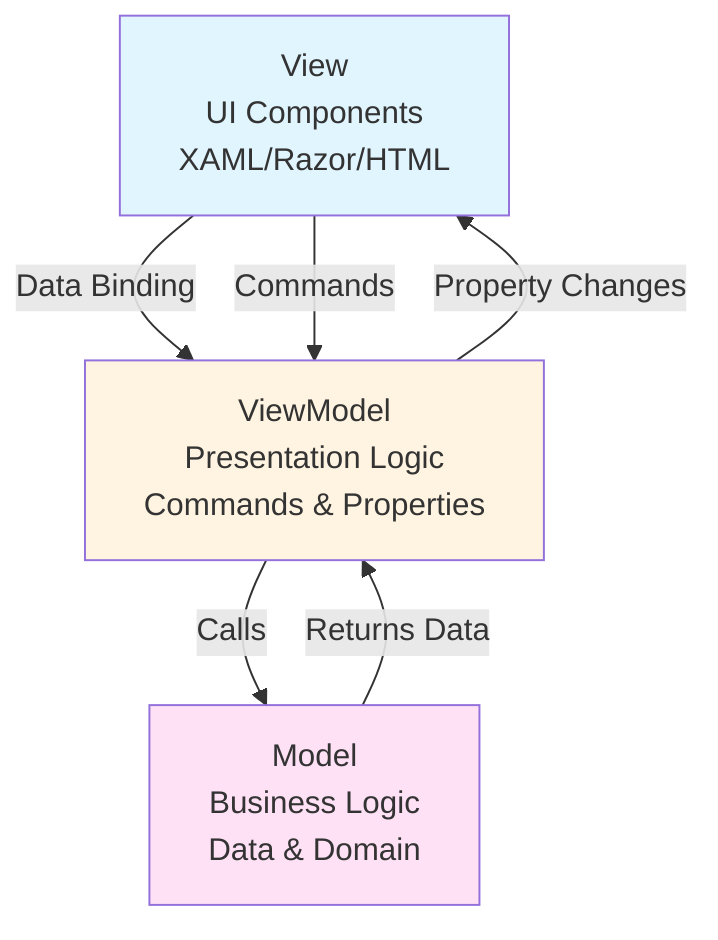

# Model-View-ViewModel (MVVM) Pattern

## Overview

The Model-View-ViewModel (MVVM) pattern is an architectural pattern that facilitates the separation of the graphical user interface (View) from the business logic and data (Model) using an intermediary layer (ViewModel). MVVM is particularly effective in applications with complex UIs like .NET MAUI, Blazor, WPF, and UWP where data binding is a core feature.

---

## Core Concepts

### The Three Layers



#### 1. Model

The **Model** represents the application's data and business logic. It knows nothing about the View or ViewModel.

**Responsibilities:**
- Domain entities
- Business rules and validation
- Data access (via repositories/services)
- Domain events
- State management

**Example:**
```csharp
// File: {ApplicationName}.Entities.{Domain}/{Entity}.cs

namespace {ApplicationName}.Entities.{Domain};

/// <summary>
/// Domain entity representing a {entity}.
/// </summary>
public sealed class {Entity}
{
    public Guid {Entity}Id { get; init; }
    public string Name { get; init; } = string.Empty;
    public decimal Amount { get; init; }
    public DateTimeOffset CreatedDate { get; init; }
    public DateTimeOffset? ChangedDate { get; set; }

    // Business logic methods
    public bool IsExpired() =>
        CreatedDate.AddYears(1) < DateTimeOffset.UtcNow;

    public decimal CalculateRemainingAmount(decimal spent) =>
        Amount - spent;
}
```

#### 2. View

The **View** is the user interface layer. It displays data and captures user interactions.

**Responsibilities:**
- UI layout (XAML, Razor, HTML)
- Visual styling
- Data binding declarations
- User input capture
- Navigation triggers

**MAUI Example:**
```xml
<!-- File: {ApplicationName}.UI.MAUI/Views/{Entity}ListView.xaml -->

<?xml version="1.0" encoding="utf-8" ?>
<ContentPage xmlns="http://schemas.microsoft.com/dotnet/2021/maui"
             xmlns:x="http://schemas.microsoft.com/winfx/2009/xaml"
             xmlns:vm="clr-namespace:{ApplicationName}.ViewModels.{Domain}"
             x:Class="{ApplicationName}.UI.MAUI.Views.{Entity}ListView"
             x:DataType="vm:{Entity}ListViewModel"
             Title="{Binding Title}">

    <Grid RowDefinitions="Auto,*,Auto" Padding="10">

        <!-- Search Bar -->
        <SearchBar Grid.Row="0"
                   Placeholder="Search {entities}..."
                   Text="{Binding SearchText}"
                   SearchCommand="{Binding SearchCommand}" />

        <!-- {Entity} List -->
        <CollectionView Grid.Row="1"
                       ItemsSource="{Binding {Entities}}"
                       SelectionMode="Single"
                       SelectedItem="{Binding Selected{Entity}}"
                       SelectionChangedCommand="{Binding SelectionChangedCommand}">
            <CollectionView.ItemTemplate>
                <DataTemplate x:DataType="vm:{Entity}ItemViewModel">
                    <Grid Padding="10" ColumnDefinitions="*,Auto">
                        <VerticalStackLayout Grid.Column="0">
                            <Label Text="{Binding Name}"
                                   FontSize="16"
                                   FontAttributes="Bold" />
                            <Label Text="{Binding Amount, StringFormat='{0:C}'}"
                                   FontSize="14" />
                        </VerticalStackLayout>
                        <Label Grid.Column="1"
                               Text="{Binding StatusIcon}"
                               FontSize="24" />
                    </Grid>
                </DataTemplate>
            </CollectionView.ItemTemplate>
        </CollectionView>

        <!-- Add Button -->
        <Button Grid.Row="2"
                Text="Add {Entity}"
                Command="{Binding AddCommand}"
                HorizontalOptions="Fill" />
    </Grid>
</ContentPage>
```

**Blazor Example:**
```razor
@* File: {ApplicationName}.UI.Blazor/Pages/{Entity}List.razor *@

@page "/{entities}"
@using {ApplicationName}.ViewModels.{Domain}
@inject {Entity}ListViewModel ViewModel

<PageTitle>@ViewModel.Title</PageTitle>

<div class="container">

    <!-- Search Bar -->
    <div class="row mb-3">
        <div class="col">
            <input type="text"
                   class="form-control"
                   placeholder="Search {entities}..."
                   @bind="ViewModel.SearchText"
                   @bind:event="oninput"
                   @onkeyup="() => ViewModel.SearchCommand.Execute(null)" />
        </div>
    </div>

    <!-- {Entity} List -->
    <div class="row">
        @foreach (var item in ViewModel.{Entities})
        {
            <div class="col-md-4 mb-3">
                <div class="card" @onclick="() => ViewModel.SelectionChangedCommand.Execute(item)">
                    <div class="card-body">
                        <h5 class="card-title">@item.Name</h5>
                        <p class="card-text">@item.Amount.ToString("C")</p>
                        <span class="badge bg-@item.StatusColor">@item.Status</span>
                    </div>
                </div>
            </div>
        }
    </div>

    <!-- Add Button -->
    <div class="row mt-3">
        <div class="col">
            <button class="btn btn-primary w-100"
                    @onclick="() => ViewModel.AddCommand.Execute(null)">
                Add {Entity}
            </button>
        </div>
    </div>
</div>

@code {
    protected override async Task OnInitializedAsync()
    {
        await ViewModel.InitializeAsync();
    }
}
```

#### 3. ViewModel

The **ViewModel** is the intermediary between View and Model. It exposes data and commands for the View to bind to.

**Responsibilities:**
- Expose data as observable properties
- Implement INotifyPropertyChanged
- Provide commands (ICommand)
- Handle presentation logic
- Coordinate with services/handlers
- Manage view state

**Example:**
```csharp
// File: {ApplicationName}.ViewModels.{Domain}/{Entity}ListViewModel.cs

namespace {ApplicationName}.ViewModels.{Domain};

using CommunityToolkit.Mvvm.ComponentModel;
using CommunityToolkit.Mvvm.Input;
using System.Collections.ObjectModel;
using I.Synergy.Framework.Core.Abstractions;
using {ApplicationName}.Domain.{Domain}.Features.{Entity}.Queries;

/// <summary>
/// ViewModel for the {entity} list view.
/// </summary>
public sealed partial class {Entity}ListViewModel : ObservableObject
{
    private readonly IQueryHandler<Get{Entity}ListQuery, List<{Entity}Response>> _queryHandler;
    private readonly INavigationService _navigationService;
    private readonly ILogger<{Entity}ListViewModel> _logger;

    public {Entity}ListViewModel(
        IQueryHandler<Get{Entity}ListQuery, List<{Entity}Response>> queryHandler,
        INavigationService navigationService,
        ILogger<{Entity}ListViewModel> logger)
    {
        _queryHandler = queryHandler;
        _navigationService = navigationService;
        _logger = logger;
    }

    /// <summary>
    /// Title of the view.
    /// </summary>
    [ObservableProperty]
    private string _title = "{Entities}";

    /// <summary>
    /// Collection of {entities}.
    /// </summary>
    [ObservableProperty]
    private ObservableCollection<{Entity}ItemViewModel> _{entities} = new();

    /// <summary>
    /// Currently selected {entity}.
    /// </summary>
    [ObservableProperty]
    private {Entity}ItemViewModel? _selected{Entity};

    /// <summary>
    /// Search text for filtering.
    /// </summary>
    [ObservableProperty]
    private string _searchText = string.Empty;

    /// <summary>
    /// Indicates if data is loading.
    /// </summary>
    [ObservableProperty]
    private bool _isLoading;

    /// <summary>
    /// Initialize the ViewModel.
    /// </summary>
    public async Task InitializeAsync(CancellationToken cancellationToken = default)
    {
        await LoadDataAsync(cancellationToken);
    }

    /// <summary>
    /// Load {entities} from the backend.
    /// </summary>
    [RelayCommand]
    private async Task LoadDataAsync(CancellationToken cancellationToken = default)
    {
        try
        {
            IsLoading = true;

            _logger.LogInformation("Loading {EntityType} list", nameof({Entity}));

            var query = new Get{Entity}ListQuery(
                PageNumber: 1,
                PageSize: 100,
                SearchTerm: string.IsNullOrWhiteSpace(SearchText) ? null : SearchText);

            var results = await _queryHandler.HandleAsync(query, cancellationToken);

            {Entities}.Clear();
            foreach (var result in results)
            {
                {Entities}.Add(new {Entity}ItemViewModel
                {
                    {Entity}Id = result.{Entity}Id,
                    Name = result.Name,
                    Amount = result.Amount,
                    StatusIcon = GetStatusIcon(result)
                });
            }

            _logger.LogInformation("Loaded {Count} {EntityType} items", {Entities}.Count, nameof({Entity}));
        }
        catch (Exception ex)
        {
            _logger.LogError(ex, "Failed to load {EntityType} list", nameof({Entity}));
        }
        finally
        {
            IsLoading = false;
        }
    }

    /// <summary>
    /// Search command.
    /// </summary>
    [RelayCommand]
    private async Task SearchAsync(CancellationToken cancellationToken = default)
    {
        await LoadDataAsync(cancellationToken);
    }

    /// <summary>
    /// Add new {entity} command.
    /// </summary>
    [RelayCommand]
    private async Task AddAsync(CancellationToken cancellationToken = default)
    {
        await _navigationService.NavigateToAsync($"/{entities}/new");
    }

    /// <summary>
    /// Selection changed command.
    /// </summary>
    [RelayCommand]
    private async Task SelectionChangedAsync(CancellationToken cancellationToken = default)
    {
        if (Selected{Entity} is not null)
        {
            await _navigationService.NavigateToAsync($"/{entities}/{Selected{Entity}.{Entity}Id}");
        }
    }

    private static string GetStatusIcon({Entity}Response entity)
    {
        // Presentation logic
        return entity.Amount > 0 ? "✓" : "⚠";
    }
}

/// <summary>
/// Item ViewModel for individual {entity} in list.
/// </summary>
public sealed partial class {Entity}ItemViewModel : ObservableObject
{
    [ObservableProperty]
    private Guid _{entity}Id;

    [ObservableProperty]
    private string _name = string.Empty;

    [ObservableProperty]
    private decimal _amount;

    [ObservableProperty]
    private string _statusIcon = string.Empty;
}
```

---

## Data Binding

### One-Way Binding

Data flows **from ViewModel to View** only. The View displays data but cannot modify the source.

**MAUI Example:**
```xml
<!-- View can display but not modify -->
<Label Text="{Binding Name}" />
<Label Text="{Binding Amount, StringFormat='{0:C}'}" />
<Label Text="{Binding CreatedDate, StringFormat='{0:d}'}" />
```

**Blazor Example:**
```razor
<!-- Display-only binding -->
<p>@ViewModel.Name</p>
<p>@ViewModel.Amount.ToString("C")</p>
<p>@ViewModel.CreatedDate.ToString("d")</p>
```

**ViewModel:**
```csharp
public sealed partial class {Entity}DetailViewModel : ObservableObject
{
    // One-way binding - View reads, cannot write
    [ObservableProperty]
    private string _name = string.Empty;

    [ObservableProperty]
    private decimal _amount;

    [ObservableProperty]
    private DateTimeOffset _createdDate;
}
```

### Two-Way Binding

Data flows **both ways**: from ViewModel to View AND from View to ViewModel. User input updates the ViewModel.

**MAUI Example:**
```xml
<!-- User can edit, changes update ViewModel -->
<Entry Text="{Binding Name, Mode=TwoWay}" />
<Entry Text="{Binding Amount, Mode=TwoWay}" Keyboard="Numeric" />
<DatePicker Date="{Binding StartDate, Mode=TwoWay}" />
<CheckBox IsChecked="{Binding IsActive, Mode=TwoWay}" />
```

**Blazor Example:**
```razor
<!-- Two-way binding with @bind -->
<input type="text" @bind="ViewModel.Name" @bind:event="oninput" />
<input type="number" @bind="ViewModel.Amount" @bind:event="oninput" />
<input type="date" @bind="ViewModel.StartDate" @bind:event="oninput" />
<input type="checkbox" @bind="ViewModel.IsActive" />
```

**ViewModel:**
```csharp
public sealed partial class {Entity}EditViewModel : ObservableObject
{
    // Two-way binding - View can read and write
    [ObservableProperty]
    private string _name = string.Empty;

    [ObservableProperty]
    private decimal _amount;

    [ObservableProperty]
    private DateTimeOffset _startDate = DateTimeOffset.UtcNow;

    [ObservableProperty]
    private bool _isActive = true;

    // Property change notifications are automatic with [ObservableProperty]
}
```

### Binding Modes

| Mode | Direction | Use Case |
|------|-----------|----------|
| **OneWay** | ViewModel → View | Display-only data (labels, status) |
| **TwoWay** | ViewModel ↔ View | User input fields (Entry, TextBox) |
| **OneWayToSource** | View → ViewModel | Rare - when View drives ViewModel |
| **OneTime** | ViewModel → View (once) | Static data that never changes |

---

## Commands and ICommand

Commands encapsulate actions that the user can trigger from the UI.

### ICommand Implementation

**Using CommunityToolkit.Mvvm:**
```csharp
// File: {ApplicationName}.ViewModels.{Domain}/{Entity}DetailViewModel.cs

namespace {ApplicationName}.ViewModels.{Domain};

using CommunityToolkit.Mvvm.ComponentModel;
using CommunityToolkit.Mvvm.Input;
using I.Synergy.Framework.Core.Abstractions;
using {ApplicationName}.Domain.{Domain}.Features.{Entity}.Commands;

public sealed partial class {Entity}DetailViewModel : ObservableObject
{
    private readonly ICommandHandler<Create{Entity}Command, Create{Entity}Response> _createHandler;
    private readonly ICommandHandler<Update{Entity}Command, Update{Entity}Response> _updateHandler;
    private readonly ICommandHandler<Delete{Entity}Command, Delete{Entity}Response> _deleteHandler;
    private readonly INavigationService _navigationService;

    public {Entity}DetailViewModel(
        ICommandHandler<Create{Entity}Command, Create{Entity}Response> createHandler,
        ICommandHandler<Update{Entity}Command, Update{Entity}Response> updateHandler,
        ICommandHandler<Delete{Entity}Command, Delete{Entity}Response> deleteHandler,
        INavigationService navigationService)
    {
        _createHandler = createHandler;
        _updateHandler = updateHandler;
        _deleteHandler = deleteHandler;
        _navigationService = navigationService;
    }

    [ObservableProperty]
    private Guid _{entity}Id;

    [ObservableProperty]
    private string _name = string.Empty;

    [ObservableProperty]
    private decimal _amount;

    [ObservableProperty]
    private bool _isNew = true;

    /// <summary>
    /// Save command - async with automatic CanExecute.
    /// </summary>
    [RelayCommand(CanExecute = nameof(CanSave))]
    private async Task SaveAsync(CancellationToken cancellationToken = default)
    {
        try
        {
            if (IsNew)
            {
                var createCommand = new Create{Entity}Command(Name, Amount, DateTimeOffset.UtcNow);
                var response = await _createHandler.HandleAsync(createCommand, cancellationToken);
                {Entity}Id = response.{Entity}Id;
                IsNew = false;
            }
            else
            {
                var updateCommand = new Update{Entity}Command({Entity}Id, Name, Amount);
                await _updateHandler.HandleAsync(updateCommand, cancellationToken);
            }

            await _navigationService.GoBackAsync();
        }
        catch (Exception ex)
        {
            // Handle error
        }
    }

    /// <summary>
    /// Determines if Save can execute.
    /// </summary>
    private bool CanSave() =>
        !string.IsNullOrWhiteSpace(Name) && Amount > 0;

    /// <summary>
    /// Delete command with confirmation.
    /// </summary>
    [RelayCommand(CanExecute = nameof(CanDelete))]
    private async Task DeleteAsync(CancellationToken cancellationToken = default)
    {
        try
        {
            var deleteCommand = new Delete{Entity}Command({Entity}Id);
            await _deleteHandler.HandleAsync(deleteCommand, cancellationToken);
            await _navigationService.GoBackAsync();
        }
        catch (Exception ex)
        {
            // Handle error
        }
    }

    /// <summary>
    /// Determines if Delete can execute.
    /// </summary>
    private bool CanDelete() => !IsNew;

    /// <summary>
    /// Cancel command.
    /// </summary>
    [RelayCommand]
    private async Task CancelAsync()
    {
        await _navigationService.GoBackAsync();
    }

    // When properties change, automatically refresh CanExecute
    partial void OnNameChanged(string value) => SaveCommand.NotifyCanExecuteChanged();
    partial void OnAmountChanged(decimal value) => SaveCommand.NotifyCanExecuteChanged();
}
```

### Command Binding in Views

**MAUI:**
```xml
<StackLayout Padding="10" Spacing="10">
    <Entry Placeholder="Name"
           Text="{Binding Name, Mode=TwoWay}" />

    <Entry Placeholder="Amount"
           Text="{Binding Amount, Mode=TwoWay}"
           Keyboard="Numeric" />

    <Button Text="Save"
            Command="{Binding SaveCommand}" />

    <Button Text="Delete"
            Command="{Binding DeleteCommand}"
            BackgroundColor="Red" />

    <Button Text="Cancel"
            Command="{Binding CancelCommand}" />
</StackLayout>
```

**Blazor:**
```razor
<div class="form-group">
    <label>Name</label>
    <input type="text" class="form-control" @bind="ViewModel.Name" @bind:event="oninput" />
</div>

<div class="form-group">
    <label>Amount</label>
    <input type="number" class="form-control" @bind="ViewModel.Amount" @bind:event="oninput" />
</div>

<div class="btn-group">
    <button class="btn btn-primary"
            @onclick="() => ViewModel.SaveCommand.ExecuteAsync(null)"
            disabled="@(!ViewModel.SaveCommand.CanExecute(null))">
        Save
    </button>

    <button class="btn btn-danger"
            @onclick="() => ViewModel.DeleteCommand.ExecuteAsync(null)"
            disabled="@(!ViewModel.DeleteCommand.CanExecute(null))">
        Delete
    </button>

    <button class="btn btn-secondary"
            @onclick="() => ViewModel.CancelCommand.Execute(null)">
        Cancel
    </button>
</div>
```

---

## ObservableObject and INotifyPropertyChanged

### CommunityToolkit.Mvvm Approach

**Using Source Generators (Recommended):**
```csharp
using CommunityToolkit.Mvvm.ComponentModel;

/// <summary>
/// Base ViewModel with property change notification.
/// </summary>
public sealed partial class {Entity}ViewModel : ObservableObject
{
    // ✅ Source generator creates the property automatically
    [ObservableProperty]
    private string _name = string.Empty;

    [ObservableProperty]
    private decimal _amount;

    [ObservableProperty]
    private bool _isActive;

    // ✅ Source generator creates backing field and property
    [ObservableProperty]
    private ObservableCollection<string> _tags = new();

    // ✅ With validation attributes
    [ObservableProperty]
    [Required]
    [StringLength(100, MinimumLength = 3)]
    private string _description = string.Empty;

    // ✅ With custom property change handling
    [ObservableProperty]
    private decimal _price;

    partial void OnPriceChanged(decimal value)
    {
        // Custom logic when price changes
        CalculateTax();
    }

    private void CalculateTax()
    {
        // Calculation logic
    }
}
```

**Manual Implementation (if needed):**
```csharp
using CommunityToolkit.Mvvm.ComponentModel;

public sealed class {Entity}ViewModel : ObservableObject
{
    private string _name = string.Empty;
    public string Name
    {
        get => _name;
        set => SetProperty(ref _name, value);
    }

    private decimal _amount;
    public decimal Amount
    {
        get => _amount;
        set
        {
            if (SetProperty(ref _amount, value))
            {
                // Custom logic after value changes
                OnPropertyChanged(nameof(FormattedAmount));
            }
        }
    }

    public string FormattedAmount => Amount.ToString("C");
}
```

---

## ObservableCollection

`ObservableCollection<T>` automatically notifies the UI when items are added, removed, or replaced.

### Usage Examples

```csharp
public sealed partial class {Entity}ListViewModel : ObservableObject
{
    // ✅ CORRECT - ObservableCollection notifies UI of changes
    [ObservableProperty]
    private ObservableCollection<{Entity}ItemViewModel> _{entities} = new();

    public async Task LoadAsync(CancellationToken ct = default)
    {
        var query = new Get{Entity}ListQuery();
        var results = await _queryHandler.HandleAsync(query, ct);

        // Clear and add - UI updates automatically
        {Entities}.Clear();
        foreach (var result in results)
        {
            {Entities}.Add(new {Entity}ItemViewModel
            {
                {Entity}Id = result.{Entity}Id,
                Name = result.Name,
                Amount = result.Amount
            });
        }
    }

    public void AddNew{Entity}({Entity}ItemViewModel item)
    {
        // UI updates automatically when item is added
        {Entities}.Add(item);
    }

    public void Remove{Entity}({Entity}ItemViewModel item)
    {
        // UI updates automatically when item is removed
        {Entities}.Remove(item);
    }

    // ❌ WRONG - List<T> doesn't notify UI
    private List<{Entity}ItemViewModel> _{entities}List = new();
    public List<{Entity}ItemViewModel> {Entities}List => _{entities}List;
    // UI won't update when items are added/removed!
}
```

---

## ViewModels as Presentation Layer

ViewModels contain presentation logic separate from business logic.

### Presentation Logic Examples

```csharp
public sealed partial class {Entity}DetailViewModel : ObservableObject
{
    [ObservableProperty]
    private decimal _amount;

    [ObservableProperty]
    private decimal _spent;

    // Computed property for presentation
    public decimal Remaining => Amount - Spent;

    // Formatted display text
    public string RemainingFormatted => Remaining.ToString("C");

    // Status indicator
    public string StatusColor => Remaining > 0 ? "Green" : "Red";

    public string StatusText => Remaining > 0 ? "Under Budget" : "Over Budget";

    // Visibility logic
    public bool ShowWarning => Remaining < (Amount * 0.1m);

    // Property changed notifications for computed properties
    partial void OnAmountChanged(decimal value)
    {
        OnPropertyChanged(nameof(Remaining));
        OnPropertyChanged(nameof(RemainingFormatted));
        OnPropertyChanged(nameof(StatusColor));
        OnPropertyChanged(nameof(StatusText));
        OnPropertyChanged(nameof(ShowWarning));
    }

    partial void OnSpentChanged(decimal value)
    {
        OnPropertyChanged(nameof(Remaining));
        OnPropertyChanged(nameof(RemainingFormatted));
        OnPropertyChanged(nameof(StatusColor));
        OnPropertyChanged(nameof(StatusText));
        OnPropertyChanged(nameof(ShowWarning));
    }
}
```

---

## Dependency Injection in ViewModels

ViewModels should be registered in the DI container and receive dependencies through constructor injection.

### Registration

```csharp
// File: {ApplicationName}.UI.MAUI/MauiProgram.cs (or Startup.cs for Blazor)

public static class MauiProgram
{
    public static MauiApp CreateMauiApp()
    {
        var builder = MauiApp.CreateBuilder();

        builder.Services
            .UseMauiApp<App>();

        // Register ViewModels
        builder.Services.AddTransient<{Entity}ListViewModel>();
        builder.Services.AddTransient<{Entity}DetailViewModel>();
        builder.Services.AddTransient<{Entity}EditViewModel>();

        // Register CQRS handlers
        builder.Services.AddCQRS().AddHandlers(typeof({Entity}).Assembly);

        // Register services
        builder.Services.AddSingleton<INavigationService, NavigationService>();
        builder.Services.AddSingleton<IDialogService, DialogService>();

        return builder.Build();
    }
}
```

### Constructor Injection

```csharp
public sealed partial class {Entity}DetailViewModel : ObservableObject
{
    private readonly IQueryHandler<Get{Entity}ByIdQuery, {Entity}Response> _queryHandler;
    private readonly ICommandHandler<Update{Entity}Command, Update{Entity}Response> _updateHandler;
    private readonly INavigationService _navigationService;
    private readonly IDialogService _dialogService;
    private readonly ILogger<{Entity}DetailViewModel> _logger;

    public {Entity}DetailViewModel(
        IQueryHandler<Get{Entity}ByIdQuery, {Entity}Response> queryHandler,
        ICommandHandler<Update{Entity}Command, Update{Entity}Response> updateHandler,
        INavigationService navigationService,
        IDialogService dialogService,
        ILogger<{Entity}DetailViewModel> logger)
    {
        _queryHandler = queryHandler;
        _updateHandler = updateHandler;
        _navigationService = navigationService;
        _dialogService = dialogService;
        _logger = logger;
    }
}
```

---

## Navigation Patterns

### Service-Based Navigation

```csharp
// File: {ApplicationName}.UI.MAUI/Services/INavigationService.cs

public interface INavigationService
{
    Task NavigateToAsync(string route, CancellationToken ct = default);
    Task NavigateToAsync<TViewModel>(CancellationToken ct = default) where TViewModel : ObservableObject;
    Task GoBackAsync(CancellationToken ct = default);
    Task NavigateToRootAsync(CancellationToken ct = default);
}

// Implementation for MAUI Shell
public sealed class NavigationService : INavigationService
{
    public async Task NavigateToAsync(string route, CancellationToken ct = default)
    {
        await Shell.Current.GoToAsync(route);
    }

    public async Task NavigateToAsync<TViewModel>(CancellationToken ct = default)
        where TViewModel : ObservableObject
    {
        var route = $"///{typeof(TViewModel).Name.Replace("ViewModel", "")}";
        await Shell.Current.GoToAsync(route);
    }

    public async Task GoBackAsync(CancellationToken ct = default)
    {
        await Shell.Current.GoToAsync("..");
    }

    public async Task NavigateToRootAsync(CancellationToken ct = default)
    {
        await Shell.Current.GoToAsync("///");
    }
}
```

### ViewModel Navigation Usage

```csharp
public sealed partial class {Entity}ListViewModel : ObservableObject
{
    private readonly INavigationService _navigationService;

    [RelayCommand]
    private async Task NavigateToDetailAsync(Guid id)
    {
        await _navigationService.NavigateToAsync($"/{entities}/{id}");
    }

    [RelayCommand]
    private async Task NavigateToNewAsync()
    {
        await _navigationService.NavigateToAsync($"/{entities}/new");
    }
}
```

---

## State Management in MVVM

### ViewModel State

```csharp
public sealed partial class {Entity}ListViewModel : ObservableObject
{
    [ObservableProperty]
    private bool _isLoading;

    [ObservableProperty]
    private bool _isRefreshing;

    [ObservableProperty]
    private string _errorMessage = string.Empty;

    [ObservableProperty]
    private bool _hasError;

    [RelayCommand]
    private async Task LoadDataAsync(CancellationToken ct = default)
    {
        try
        {
            IsLoading = true;
            HasError = false;
            ErrorMessage = string.Empty;

            var query = new Get{Entity}ListQuery();
            var results = await _queryHandler.HandleAsync(query, ct);

            {Entities}.Clear();
            foreach (var result in results)
            {
                {Entities}.Add(Map(result));
            }
        }
        catch (Exception ex)
        {
            HasError = true;
            ErrorMessage = "Failed to load {entities}. Please try again.";
            _logger.LogError(ex, "Failed to load {EntityType} list", nameof({Entity}));
        }
        finally
        {
            IsLoading = false;
            IsRefreshing = false;
        }
    }
}
```

### View Binding to State

**MAUI:**
```xml
<ContentPage>
    <Grid>
        <!-- Loading Indicator -->
        <ActivityIndicator IsRunning="{Binding IsLoading}"
                          IsVisible="{Binding IsLoading}"
                          HorizontalOptions="Center"
                          VerticalOptions="Center" />

        <!-- Content (hidden when loading) -->
        <CollectionView ItemsSource="{Binding {Entities}}"
                       IsVisible="{Binding IsLoading, Converter={StaticResource InvertedBoolConverter}}" />

        <!-- Error Message -->
        <Label Text="{Binding ErrorMessage}"
               IsVisible="{Binding HasError}"
               TextColor="Red"
               HorizontalOptions="Center"
               VerticalOptions="Center" />
    </Grid>
</ContentPage>
```

**Blazor:**
```razor
@if (ViewModel.IsLoading)
{
    <div class="spinner-border" role="status">
        <span class="visually-hidden">Loading...</span>
    </div>
}
else if (ViewModel.HasError)
{
    <div class="alert alert-danger">
        @ViewModel.ErrorMessage
    </div>
}
else
{
    @foreach (var item in ViewModel.{Entities})
    {
        <div class="card">
            <div class="card-body">
                <h5>@item.Name</h5>
                <p>@item.Amount.ToString("C")</p>
            </div>
        </div>
    }
}
```

---

## Testing ViewModels

### Unit Testing Pattern

```csharp
// File: tests/{ApplicationName}.{Domain}.Tests/ViewModels/{Entity}ListViewModelTests.cs

using Microsoft.VisualStudio.TestTools.UnitTesting;
using Moq;
using {ApplicationName}.ViewModels.{Domain};
using {ApplicationName}.Domain.{Domain}.Features.{Entity}.Queries;

[TestClass]
public sealed class {Entity}ListViewModelTests
{
    private Mock<IQueryHandler<Get{Entity}ListQuery, List<{Entity}Response>>> _queryHandlerMock;
    private Mock<INavigationService> _navigationServiceMock;
    private Mock<ILogger<{Entity}ListViewModel>> _loggerMock;
    private {Entity}ListViewModel _viewModel;

    [TestInitialize]
    public void Setup()
    {
        _queryHandlerMock = new Mock<IQueryHandler<Get{Entity}ListQuery, List<{Entity}Response>>>();
        _navigationServiceMock = new Mock<INavigationService>();
        _loggerMock = new Mock<ILogger<{Entity}ListViewModel>>();

        _viewModel = new {Entity}ListViewModel(
            _queryHandlerMock.Object,
            _navigationServiceMock.Object,
            _loggerMock.Object);
    }

    [TestMethod]
    public async Task LoadDataAsync_WithResults_Populates{Entities}Collection()
    {
        // Arrange
        var testData = new List<{Entity}Response>
        {
            new({Entity}Id: Guid.NewGuid(), Name: "Test 1", Amount: 100, Property3: DateTimeOffset.UtcNow, CreatedDate: DateTimeOffset.UtcNow, ChangedDate: null),
            new({Entity}Id: Guid.NewGuid(), Name: "Test 2", Amount: 200, Property3: DateTimeOffset.UtcNow, CreatedDate: DateTimeOffset.UtcNow, ChangedDate: null)
        };

        _queryHandlerMock
            .Setup(x => x.HandleAsync(It.IsAny<Get{Entity}ListQuery>(), It.IsAny<CancellationToken>()))
            .ReturnsAsync(testData);

        // Act
        await _viewModel.LoadDataCommand.ExecuteAsync(null);

        // Assert
        Assert.AreEqual(2, _viewModel.{Entities}.Count);
        Assert.AreEqual("Test 1", _viewModel.{Entities}[0].Name);
        Assert.AreEqual(100, _viewModel.{Entities}[0].Amount);
    }

    [TestMethod]
    public async Task LoadDataAsync_WithException_SetsErrorState()
    {
        // Arrange
        _queryHandlerMock
            .Setup(x => x.HandleAsync(It.IsAny<Get{Entity}ListQuery>(), It.IsAny<CancellationToken>()))
            .ThrowsAsync(new Exception("Test exception"));

        // Act
        await _viewModel.LoadDataCommand.ExecuteAsync(null);

        // Assert
        Assert.IsTrue(_viewModel.HasError);
        Assert.IsFalse(string.IsNullOrWhiteSpace(_viewModel.ErrorMessage));
        Assert.AreEqual(0, _viewModel.{Entities}.Count);
    }

    [TestMethod]
    public async Task AddCommand_NavigatesToNewPage()
    {
        // Act
        await _viewModel.AddCommand.ExecuteAsync(null);

        // Assert
        _navigationServiceMock.Verify(
            x => x.NavigateToAsync("/{entities}/new", It.IsAny<CancellationToken>()),
            Times.Once);
    }

    [TestMethod]
    public void SaveCommand_CanExecute_ReturnsFalseWhenNameEmpty()
    {
        // Arrange
        var detailViewModel = CreateDetailViewModel();
        detailViewModel.Name = "";
        detailViewModel.Amount = 100;

        // Act
        var canExecute = detailViewModel.SaveCommand.CanExecute(null);

        // Assert
        Assert.IsFalse(canExecute);
    }

    [TestMethod]
    public void SaveCommand_CanExecute_ReturnsTrueWhenValid()
    {
        // Arrange
        var detailViewModel = CreateDetailViewModel();
        detailViewModel.Name = "Valid Name";
        detailViewModel.Amount = 100;

        // Act
        var canExecute = detailViewModel.SaveCommand.CanExecute(null);

        // Assert
        Assert.IsTrue(canExecute);
    }
}
```

---

## MVVM in .NET MAUI

### MAUI-Specific Patterns

**Shell Navigation:**
```csharp
// File: AppShell.xaml.cs

public partial class AppShell : Shell
{
    public AppShell()
    {
        InitializeComponent();

        // Register routes
        Routing.RegisterRoute(nameof({Entity}ListPage), typeof({Entity}ListPage));
        Routing.RegisterRoute(nameof({Entity}DetailPage), typeof({Entity}DetailPage));
        Routing.RegisterRoute(nameof({Entity}EditPage), typeof({Entity}EditPage));
    }
}
```

**Page with ViewModel:**
```csharp
// File: {Entity}ListPage.xaml.cs

public partial class {Entity}ListPage : ContentPage
{
    public {Entity}ListPage({Entity}ListViewModel viewModel)
    {
        InitializeComponent();
        BindingContext = viewModel;
    }

    protected override async void OnAppearing()
    {
        base.OnAppearing();

        if (BindingContext is {Entity}ListViewModel vm)
        {
            await vm.LoadDataCommand.ExecuteAsync(null);
        }
    }
}
```

### Platform-Specific Behaviors

```csharp
public sealed partial class {Entity}DetailViewModel : ObservableObject
{
    [RelayCommand]
    private async Task ShareAsync()
    {
#if ANDROID || IOS
        await Share.RequestAsync(new ShareTextRequest
        {
            Title = "Share {Entity}",
            Text = $"{Name}: {Amount:C}"
        });
#else
        await _dialogService.ShowAlertAsync("Sharing not supported on this platform");
#endif
    }
}
```

---

## MVVM in Blazor

### Blazor-Specific Adaptations

**Component with ViewModel:**
```razor
@* File: {Entity}List.razor *@

@page "/{entities}"
@using {ApplicationName}.ViewModels.{Domain}
@inject {Entity}ListViewModel ViewModel
@implements IDisposable

<h3>@ViewModel.Title</h3>

@if (ViewModel.IsLoading)
{
    <p><em>Loading...</em></p>
}
else
{
    <div class="row">
        @foreach (var item in ViewModel.{Entities})
        {
            <div class="col-md-4">
                <div class="card mb-3">
                    <div class="card-body">
                        <h5 class="card-title">@item.Name</h5>
                        <p class="card-text">@item.Amount.ToString("C")</p>
                        <button class="btn btn-primary"
                                @onclick="() => NavigateToDetail(item.{Entity}Id)">
                            View Details
                        </button>
                    </div>
                </div>
            </div>
        }
    </div>
}

@code {
    protected override async Task OnInitializedAsync()
    {
        // Subscribe to property changes
        ViewModel.PropertyChanged += OnViewModelPropertyChanged;

        await ViewModel.InitializeAsync();
    }

    private void OnViewModelPropertyChanged(object? sender, PropertyChangedEventArgs e)
    {
        // Trigger UI refresh when ViewModel properties change
        InvokeAsync(StateHasChanged);
    }

    private async Task NavigateToDetail(Guid id)
    {
        await ViewModel.SelectionChangedCommand.ExecuteAsync(null);
    }

    public void Dispose()
    {
        // Unsubscribe from events
        if (ViewModel is not null)
        {
            ViewModel.PropertyChanged -= OnViewModelPropertyChanged;
        }
    }
}
```

**ViewModel Registration in Blazor:**
```csharp
// File: Program.cs

var builder = WebApplication.CreateBuilder(args);

builder.Services.AddRazorPages();
builder.Services.AddServerSideBlazor();

// Register ViewModels as scoped for Blazor Server
builder.Services.AddScoped<{Entity}ListViewModel>();
builder.Services.AddScoped<{Entity}DetailViewModel>();

// Or as transient for Blazor WebAssembly
// builder.Services.AddTransient<{Entity}ListViewModel>();

var app = builder.Build();
app.Run();
```

---

## CommunityToolkit.Mvvm Usage

### Installation

```xml
<PackageReference Include="CommunityToolkit.Mvvm" Version="8.3.0" />
```

### Key Features

**1. ObservableObject Base Class**
```csharp
using CommunityToolkit.Mvvm.ComponentModel;

public sealed partial class MyViewModel : ObservableObject
{
    [ObservableProperty]
    private string _name = string.Empty;

    // Generated property: public string Name { get; set; }
}
```

**2. RelayCommand Attribute**
```csharp
[RelayCommand]
private async Task LoadDataAsync()
{
    // Command implementation
}

// Generated: public IAsyncRelayCommand LoadDataCommand { get; }
```

**3. Property Validation**
```csharp
using CommunityToolkit.Mvvm.ComponentModel;
using System.ComponentModel.DataAnnotations;

public sealed partial class {Entity}EditViewModel : ObservableValidator
{
    [ObservableProperty]
    [Required]
    [MinLength(3)]
    [MaxLength(100)]
    private string _name = string.Empty;

    [ObservableProperty]
    [Range(0.01, double.MaxValue)]
    private decimal _amount;

    partial void OnNameChanged(string value)
    {
        ValidateProperty(value, nameof(Name));
    }

    partial void OnAmountChanged(decimal value)
    {
        ValidateProperty(value, nameof(Amount));
    }
}
```

---

## Messenger Patterns for ViewModel Communication

### Using WeakReferenceMessenger

```csharp
using CommunityToolkit.Mvvm.Messaging;
using CommunityToolkit.Mvvm.Messaging.Messages;

// Define a message
public sealed class {Entity}CreatedMessage : ValueChangedMessage<Guid>
{
    public {Entity}CreatedMessage(Guid value) : base(value) { }
}

// Sender ViewModel
public sealed partial class {Entity}EditViewModel : ObservableObject
{
    [RelayCommand]
    private async Task SaveAsync()
    {
        var createCommand = new Create{Entity}Command(Name, Amount, DateTimeOffset.UtcNow);
        var response = await _createHandler.HandleAsync(createCommand);

        // Send message
        WeakReferenceMessenger.Default.Send(new {Entity}CreatedMessage(response.{Entity}Id));

        await _navigationService.GoBackAsync();
    }
}

// Receiver ViewModel
public sealed partial class {Entity}ListViewModel : ObservableObject,
    IRecipient<{Entity}CreatedMessage>
{
    public {Entity}ListViewModel()
    {
        // Register to receive messages
        WeakReferenceMessenger.Default.Register<{Entity}CreatedMessage>(this);
    }

    public void Receive({Entity}CreatedMessage message)
    {
        // Handle the message - refresh list
        _ = LoadDataCommand.ExecuteAsync(null);
    }
}
```

---

## Common Pitfalls

### ❌ WRONG - Tight Coupling

```csharp
// ❌ ViewModel directly references View
public sealed class {Entity}ViewModel : ObservableObject
{
    private readonly {Entity}Page _page;

    public {Entity}ViewModel({Entity}Page page)
    {
        _page = page; // ❌ BAD - tight coupling
    }

    public void UpdateUI()
    {
        _page.UpdateDisplay(); // ❌ ViewModel shouldn't control View
    }
}
```

### ✅ CORRECT - Loose Coupling

```csharp
// ✅ ViewModel uses services and properties
public sealed partial class {Entity}ViewModel : ObservableObject
{
    private readonly INavigationService _navigationService;
    private readonly IDialogService _dialogService;

    [ObservableProperty]
    private string _displayMessage = string.Empty;

    public async Task UpdateDataAsync()
    {
        DisplayMessage = "Data updated successfully";
        await _dialogService.ShowAlertAsync("Success", DisplayMessage);
    }
}
```

### ❌ WRONG - Business Logic in View

```razor
@* ❌ Business logic in Razor component *@
@code {
    private decimal CalculateTax(decimal amount)
    {
        return amount * 0.15m; // ❌ Business logic in View
    }

    private bool IsEligibleForDiscount(Customer customer)
    {
        return customer.TotalPurchases > 1000; // ❌ Business rule in View
    }
}
```

### ✅ CORRECT - Business Logic in Model/Service

```csharp
// ✅ Business logic in domain service
public sealed class TaxCalculationService
{
    public decimal CalculateTax(decimal amount) => amount * 0.15m;
}

public sealed class DiscountEligibilityService
{
    public bool IsEligibleForDiscount(Customer customer) =>
        customer.TotalPurchases > 1000;
}

// ViewModel uses services
public sealed partial class CheckoutViewModel : ObservableObject
{
    private readonly TaxCalculationService _taxService;
    private readonly DiscountEligibilityService _discountService;

    public decimal TotalWithTax => _taxService.CalculateTax(SubTotal);
    public bool CanApplyDiscount => _discountService.IsEligibleForDiscount(CurrentCustomer);
}
```

### ❌ WRONG - Using List Instead of ObservableCollection

```csharp
// ❌ List doesn't notify UI of changes
[ObservableProperty]
private List<{Entity}ItemViewModel> _{entities} = new();

public void AddItem({Entity}ItemViewModel item)
{
    {Entities}.Add(item); // ❌ UI won't update!
}
```

### ✅ CORRECT - Use ObservableCollection

```csharp
// ✅ ObservableCollection notifies UI
[ObservableProperty]
private ObservableCollection<{Entity}ItemViewModel> _{entities} = new();

public void AddItem({Entity}ItemViewModel item)
{
    {Entities}.Add(item); // ✅ UI updates automatically
}
```

### ❌ WRONG - Async Void Commands

```csharp
// ❌ Async void - exceptions are swallowed
public ICommand LoadDataCommand => new Command(async () =>
{
    await LoadDataAsync(); // ❌ Exceptions lost
});
```

### ✅ CORRECT - Async Task Commands

```csharp
// ✅ Async Task - proper exception handling
[RelayCommand]
private async Task LoadDataAsync()
{
    try
    {
        var data = await _service.GetDataAsync();
        // Process data
    }
    catch (Exception ex)
    {
        _logger.LogError(ex, "Failed to load data");
        HasError = true;
    }
}
```

### ❌ WRONG - Direct Navigation in ViewModel

```csharp
// ❌ ViewModel directly manipulates Shell navigation
[RelayCommand]
private async Task NavigateToDetailAsync()
{
    await Shell.Current.GoToAsync("/detail"); // ❌ Platform-specific code in ViewModel
}
```

### ✅ CORRECT - Navigation via Service

```csharp
// ✅ Use abstraction
[RelayCommand]
private async Task NavigateToDetailAsync()
{
    await _navigationService.NavigateToAsync("/detail"); // ✅ Testable
}
```

---

## Best Practices Summary

### DO:
- ✅ Use `ObservableObject` from CommunityToolkit.Mvvm
- ✅ Use `[ObservableProperty]` for automatic property generation
- ✅ Use `[RelayCommand]` for commands
- ✅ Use `ObservableCollection<T>` for collections
- ✅ Inject dependencies through constructors
- ✅ Keep ViewModels testable (no platform-specific code)
- ✅ Use services for navigation, dialogs, and other UI interactions
- ✅ Implement proper async/await patterns
- ✅ Handle exceptions in commands
- ✅ Use property change notifications for computed properties
- ✅ Keep business logic in Model layer
- ✅ Use Messenger for cross-ViewModel communication

### DON'T:
- ❌ Reference Views from ViewModels
- ❌ Put business logic in Views or ViewModels
- ❌ Use `List<T>` for data-bound collections
- ❌ Use `async void` in commands
- ❌ Hard-code platform-specific code in ViewModels
- ❌ Forget to unsubscribe from events/messages
- ❌ Mix UI logic with business logic
- ❌ Ignore `CanExecute` for commands
- ❌ Forget to call `NotifyCanExecuteChanged` when conditions change
- ❌ Create tight coupling between layers

---

## Quality Checklist

- [ ] ViewModel inherits from `ObservableObject`
- [ ] Properties use `[ObservableProperty]` attribute
- [ ] Commands use `[RelayCommand]` attribute
- [ ] Collections use `ObservableCollection<T>`
- [ ] Dependencies injected through constructor
- [ ] No View references in ViewModel
- [ ] No business logic in View or ViewModel
- [ ] Async commands return `Task`, not `void`
- [ ] Proper exception handling in commands
- [ ] `CanExecute` implemented where appropriate
- [ ] Navigation through service abstraction
- [ ] Dialogs through service abstraction
- [ ] No platform-specific code in ViewModel
- [ ] Unit tests for ViewModels
- [ ] Property change notifications for computed properties
- [ ] Proper cleanup/disposal of event subscriptions
- [ ] Logging for errors and important operations
- [ ] ViewModels registered in DI container

---

**End of MVVM Pattern**
