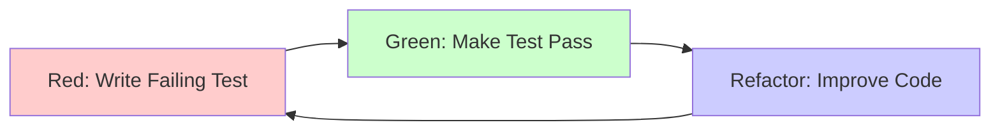

# Test-Driven Development (TDD) Pattern

## Overview

Test-Driven Development (TDD) is a software development methodology where tests are written before the actual code. The TDD cycle follows a simple mantra: **Red-Green-Refactor**. This approach ensures code correctness, improves design, provides living documentation, and increases developer confidence.

---

## The TDD Cycle: Red-Green-Refactor



### 1. RED - Write a Failing Test

Write a test for the next bit of functionality you want to add. The test should fail because the functionality doesn't exist yet.

```csharp
// File: tests/{ApplicationName}.{Domain}.Tests/Handlers/CreateBudgetHandlerTests.cs

using Microsoft.VisualStudio.TestTools.UnitTesting;

[TestClass]
public sealed class CreateBudgetHandlerTests
{
    [TestMethod]
    public async Task HandleAsync_ValidCommand_CreatesBudget()
    {
        // This test will FAIL because CreateBudgetHandler doesn't exist yet
        var handler = new CreateBudgetHandler();
        var command = new CreateBudgetCommand("Test Budget", 1000m, DateTimeOffset.UtcNow);

        var result = await handler.HandleAsync(command);

        Assert.IsNotNull(result);
        Assert.AreNotEqual(Guid.Empty, result.BudgetId);
    }
}

// ❌ RED: Test fails - CreateBudgetHandler doesn't exist
```

### 2. GREEN - Make the Test Pass

Write the minimum amount of code necessary to make the test pass. Don't worry about perfect code yet.

```csharp
// File: {ApplicationName}.Domain.{Domain}/Features/Budget/Commands/CreateBudgetCommand.cs

public sealed record CreateBudgetCommand(
    string Name,
    decimal Amount,
    DateTimeOffset StartDate
) : ICommand<CreateBudgetResponse>;

public sealed record CreateBudgetResponse(Guid BudgetId);

// File: {ApplicationName}.Domain.{Domain}/Features/Budget/Commands/CreateBudgetHandler.cs

public sealed class CreateBudgetHandler : ICommandHandler<CreateBudgetCommand, CreateBudgetResponse>
{
    public async Task<CreateBudgetResponse> HandleAsync(
        CreateBudgetCommand command,
        CancellationToken cancellationToken = default)
    {
        // Minimum code to make test pass
        var budgetId = Guid.NewGuid();
        return new CreateBudgetResponse(budgetId);
    }
}

// ✅ GREEN: Test passes - handler returns a BudgetId
```

### 3. REFACTOR - Improve the Code

Now that the test passes, refactor the code to improve its design without changing its behavior.

```csharp
// File: {ApplicationName}.Domain.{Domain}/Features/Budget/Commands/CreateBudgetHandler.cs

public sealed class CreateBudgetHandler(
    DataContext dataContext,
    ILogger<CreateBudgetHandler> logger
) : ICommandHandler<CreateBudgetCommand, CreateBudgetResponse>
{
    public async Task<CreateBudgetResponse> HandleAsync(
        CreateBudgetCommand command,
        CancellationToken cancellationToken = default)
    {
        // Refactored: Proper implementation with validation, logging, persistence
        ArgumentNullException.ThrowIfNull(command);
        ArgumentException.ThrowIfNullOrWhiteSpace(command.Name, nameof(command.Name));

        if (command.Amount <= 0)
            throw new ArgumentException("Amount must be positive", nameof(command.Amount));

        logger.LogInformation(
            "Creating {EntityType} with Name: {Name}",
            nameof(Budget), command.Name);

        var entity = command.Adapt<Budget>();
        var model = entity.Adapt<BudgetModel>();
        await dataContext.AddItemAsync<Budget, BudgetModel>(model, cancellationToken);

        logger.LogInformation(
            "Created {EntityType} with ID: {EntityId}",
            nameof(Budget), entity.BudgetId);

        return new CreateBudgetResponse(entity.BudgetId);
    }
}

// ✅ REFACTOR: Code improved, tests still pass
```

---

## Writing Tests First (Test-First Development)

### The Test-First Workflow

1. **Understand the requirement**
2. **Write a test** that describes the behavior
3. **Run the test** - it should fail (RED)
4. **Write the code** to make the test pass (GREEN)
5. **Refactor** the code (REFACTOR)
6. **Repeat** for the next requirement

### Example: Implementing Budget Validation

**Requirement:** Budget name must be between 3 and 100 characters.

**Step 1: Write Test for Empty Name**
```csharp
[TestMethod]
[ExpectedException(typeof(ArgumentException))]
public async Task HandleAsync_EmptyName_ThrowsArgumentException()
{
    // Arrange
    var handler = CreateHandler();
    var command = new CreateBudgetCommand("", 1000m, DateTimeOffset.UtcNow);

    // Act
    await handler.HandleAsync(command);

    // Assert - Exception expected
}
```

**Step 2: Make Test Pass**
```csharp
public async Task<CreateBudgetResponse> HandleAsync(
    CreateBudgetCommand command,
    CancellationToken cancellationToken = default)
{
    ArgumentException.ThrowIfNullOrWhiteSpace(command.Name, nameof(command.Name));

    // Rest of implementation...
}
```

**Step 3: Write Test for Name Too Short**
```csharp
[TestMethod]
[ExpectedException(typeof(ArgumentException))]
public async Task HandleAsync_NameTooShort_ThrowsArgumentException()
{
    // Arrange
    var handler = CreateHandler();
    var command = new CreateBudgetCommand("AB", 1000m, DateTimeOffset.UtcNow);

    // Act
    await handler.HandleAsync(command);

    // Assert - Exception expected
}
```

**Step 4: Implement Validation**
```csharp
public async Task<CreateBudgetResponse> HandleAsync(
    CreateBudgetCommand command,
    CancellationToken cancellationToken = default)
{
    ArgumentException.ThrowIfNullOrWhiteSpace(command.Name, nameof(command.Name));

    if (command.Name.Length < 3 || command.Name.Length > 100)
        throw new ArgumentException(
            "Name must be between 3 and 100 characters",
            nameof(command.Name));

    // Rest of implementation...
}
```

---

## Test Structure: Arrange-Act-Assert (AAA)

### AAA Pattern

Every test should be organized into three clear sections:

1. **Arrange** - Set up test data and dependencies
2. **Act** - Execute the code under test
3. **Assert** - Verify the results

```csharp
[TestMethod]
public async Task HandleAsync_ValidCommand_CreatesBudget()
{
    // ARRANGE - Set up test data and mocks
    var dataContextMock = new Mock<DataContext>();
    var loggerMock = new Mock<ILogger<CreateBudgetHandler>>();
    var handler = new CreateBudgetHandler(
        dataContextMock.Object,
        loggerMock.Object);

    var command = new CreateBudgetCommand(
        Name: "Test Budget",
        Amount: 1000m,
        StartDate: DateTimeOffset.UtcNow);

    // ACT - Execute the method under test
    var result = await handler.HandleAsync(command);

    // ASSERT - Verify the results
    Assert.IsNotNull(result);
    Assert.AreNotEqual(Guid.Empty, result.BudgetId);

    dataContextMock.Verify(
        x => x.AddItemAsync<Budget, BudgetModel>(
            It.IsAny<BudgetModel>(),
            It.IsAny<CancellationToken>()),
        Times.Once);
}
```

### Given-When-Then (BDD Style)

An alternative structure popular in Behavior-Driven Development:

```csharp
[TestMethod]
public async Task CreateBudget_WhenNameIsTooShort_ThenThrowsException()
{
    // GIVEN a budget with name too short
    var handler = CreateHandler();
    var command = new CreateBudgetCommand("AB", 1000m, DateTimeOffset.UtcNow);

    // WHEN creating the budget
    var act = async () => await handler.HandleAsync(command);

    // THEN it should throw ArgumentException
    await Assert.ThrowsExceptionAsync<ArgumentException>(act);
}
```

---

## Unit Testing in TDD

### Characteristics of Good Unit Tests

1. **Fast** - Run in milliseconds
2. **Isolated** - No dependencies on external systems
3. **Repeatable** - Same result every time
4. **Self-Validating** - Pass or fail, no manual verification
5. **Timely** - Written before production code

### Unit Test Example with Mocking

```csharp
// File: tests/{ApplicationName}.{Domain}.Tests/Handlers/UpdateBudgetHandlerTests.cs

using Microsoft.VisualStudio.TestTools.UnitTesting;
using Moq;

[TestClass]
public sealed class UpdateBudgetHandlerTests
{
    private Mock<DataContext> _dataContextMock;
    private Mock<ILogger<UpdateBudgetHandler>> _loggerMock;
    private UpdateBudgetHandler _handler;

    [TestInitialize]
    public void Setup()
    {
        _dataContextMock = new Mock<DataContext>();
        _loggerMock = new Mock<ILogger<UpdateBudgetHandler>>();
        _handler = new UpdateBudgetHandler(
            _dataContextMock.Object,
            _loggerMock.Object);
    }

    [TestMethod]
    public async Task HandleAsync_ValidCommand_UpdatesBudget()
    {
        // Arrange
        var budgetId = Guid.NewGuid();
        var existingBudget = new BudgetModel
        {
            BudgetId = budgetId,
            Name = "Old Name",
            Amount = 500m
        };

        _dataContextMock
            .Setup(x => x.GetItemByIdAsync<Budget, BudgetModel, Guid>(
                budgetId,
                It.IsAny<CancellationToken>()))
            .ReturnsAsync(existingBudget);

        var command = new UpdateBudgetCommand(budgetId, "New Name", 1000m);

        // Act
        var result = await _handler.HandleAsync(command);

        // Assert
        Assert.IsTrue(result.Success);

        _dataContextMock.Verify(
            x => x.UpdateItemAsync<Budget, BudgetModel>(
                It.Is<BudgetModel>(m => m.Name == "New Name" && m.Amount == 1000m),
                It.IsAny<CancellationToken>()),
            Times.Once);
    }

    [TestMethod]
    public async Task HandleAsync_NegativeAmount_ThrowsArgumentException()
    {
        // Arrange
        var command = new UpdateBudgetCommand(Guid.NewGuid(), "Budget", -100m);

        // Act & Assert
        await Assert.ThrowsExceptionAsync<ArgumentException>(
            async () => await _handler.HandleAsync(command));
    }

    [TestMethod]
    public async Task HandleAsync_NonExistentBudget_ThrowsNotFoundException()
    {
        // Arrange
        var budgetId = Guid.NewGuid();

        _dataContextMock
            .Setup(x => x.GetItemByIdAsync<Budget, BudgetModel, Guid>(
                budgetId,
                It.IsAny<CancellationToken>()))
            .ThrowsAsync(new NotFoundException($"Budget {budgetId} not found"));

        var command = new UpdateBudgetCommand(budgetId, "Budget", 1000m);

        // Act & Assert
        await Assert.ThrowsExceptionAsync<NotFoundException>(
            async () => await _handler.HandleAsync(command));
    }
}
```

---

## Integration Testing in TDD

### Integration Test Characteristics

- Test interactions between components
- May use real database (in-memory or test database)
- Test API endpoints end-to-end
- Slower than unit tests but more comprehensive

### Integration Test Example

```csharp
// File: tests/{ApplicationName}.{Domain}.Tests/Integration/BudgetEndpointsTests.cs

using Microsoft.AspNetCore.Mvc.Testing;
using Microsoft.EntityFrameworkCore;
using Microsoft.VisualStudio.TestTools.UnitTesting;

[TestClass]
public sealed class BudgetEndpointsTests
{
    private WebApplicationFactory<Program> _factory;
    private HttpClient _client;
    private DataContext _dbContext;

    [TestInitialize]
    public void Setup()
    {
        _factory = new WebApplicationFactory<Program>()
            .WithWebHostBuilder(builder =>
            {
                builder.ConfigureServices(services =>
                {
                    // Replace real database with in-memory database
                    var descriptor = services.SingleOrDefault(
                        d => d.ServiceType == typeof(DbContextOptions<DataContext>));

                    if (descriptor != null)
                        services.Remove(descriptor);

                    services.AddDbContext<DataContext>(options =>
                    {
                        options.UseInMemoryDatabase("TestDb");
                    });

                    var sp = services.BuildServiceProvider();
                    _dbContext = sp.GetRequiredService<DataContext>();
                    _dbContext.Database.EnsureCreated();
                });
            });

        _client = _factory.CreateClient();
    }

    [TestCleanup]
    public void Cleanup()
    {
        _dbContext?.Database.EnsureDeleted();
        _dbContext?.Dispose();
        _client?.Dispose();
        _factory?.Dispose();
    }

    [TestMethod]
    public async Task POST_Budget_ReturnsCreatedBudget()
    {
        // Arrange
        var request = new
        {
            Name = "Test Budget",
            Amount = 1000m,
            StartDate = DateTimeOffset.UtcNow
        };

        // Act
        var response = await _client.PostAsJsonAsync("/api/budgets", request);

        // Assert
        Assert.AreEqual(HttpStatusCode.Created, response.StatusCode);

        var result = await response.Content.ReadFromJsonAsync<CreateBudgetResponse>();
        Assert.IsNotNull(result);
        Assert.AreNotEqual(Guid.Empty, result.BudgetId);
    }

    [TestMethod]
    public async Task GET_BudgetById_ReturnsCorrectBudget()
    {
        // Arrange - Create a budget first
        var createRequest = new
        {
            Name = "Test Budget",
            Amount = 1000m,
            StartDate = DateTimeOffset.UtcNow
        };

        var createResponse = await _client.PostAsJsonAsync("/api/budgets", createRequest);
        var createdBudget = await createResponse.Content.ReadFromJsonAsync<CreateBudgetResponse>();

        // Act
        var getResponse = await _client.GetAsync($"/api/budgets/{createdBudget.BudgetId}");

        // Assert
        Assert.AreEqual(HttpStatusCode.OK, getResponse.StatusCode);

        var budget = await getResponse.Content.ReadFromJsonAsync<BudgetResponse>();
        Assert.IsNotNull(budget);
        Assert.AreEqual(createdBudget.BudgetId, budget.BudgetId);
        Assert.AreEqual("Test Budget", budget.Name);
        Assert.AreEqual(1000m, budget.Amount);
    }

    [TestMethod]
    public async Task DELETE_Budget_RemovesBudget()
    {
        // Arrange - Create a budget
        var createRequest = new
        {
            Name = "Test Budget",
            Amount = 1000m,
            StartDate = DateTimeOffset.UtcNow
        };

        var createResponse = await _client.PostAsJsonAsync("/api/budgets", createRequest);
        var createdBudget = await createResponse.Content.ReadFromJsonAsync<CreateBudgetResponse>();

        // Act - Delete the budget
        var deleteResponse = await _client.DeleteAsync($"/api/budgets/{createdBudget.BudgetId}");

        // Assert - Delete succeeded
        Assert.AreEqual(HttpStatusCode.NoContent, deleteResponse.StatusCode);

        // Verify budget is gone
        var getResponse = await _client.GetAsync($"/api/budgets/{createdBudget.BudgetId}");
        Assert.AreEqual(HttpStatusCode.NotFound, getResponse.StatusCode);
    }
}
```

---

## Acceptance Testing with Reqnroll

### Gherkin Feature Files

Gherkin provides a business-readable syntax for defining behavior.

```gherkin
# File: tests/{ApplicationName}.{Domain}.Tests/Features/BudgetManagement.feature

Feature: Budget Management
  As a user
  I want to manage my budgets
  So that I can track my financial planning

  Background:
    Given I am an authenticated user

  Scenario: Create a new budget
    When I create a budget with the following details:
      | Name         | Amount | StartDate  |
      | Q1 2025      | 10000  | 2025-01-01 |
    Then the budget should be created successfully
    And the budget should have a unique identifier
    And the budget should be retrievable by its identifier

  Scenario: Cannot create budget with negative amount
    When I attempt to create a budget with amount -1000
    Then the creation should fail with a validation error
    And the error message should indicate the amount must be positive

  Scenario: Update budget name and amount
    Given a budget exists with name "Original Budget" and amount 5000
    When I update the budget name to "Updated Budget" and amount to 7000
    Then the budget should be updated successfully
    And the budget name should be "Updated Budget"
    And the budget amount should be 7000

  Scenario: Delete a budget
    Given a budget exists with name "Old Budget"
    When I delete the budget
    Then the budget should be deleted successfully
    And the budget should no longer be retrievable

  Scenario: Get list of budgets with pagination
    Given the following budgets exist:
      | Name      | Amount |
      | Budget 1  | 1000   |
      | Budget 2  | 2000   |
      | Budget 3  | 3000   |
      | Budget 4  | 4000   |
      | Budget 5  | 5000   |
    When I request page 1 with page size 3
    Then I should receive 3 budgets
    And the budgets should be ordered by creation date descending

  Scenario: Search budgets by name
    Given the following budgets exist:
      | Name            | Amount |
      | 2025 Q1 Budget  | 10000  |
      | 2025 Q2 Budget  | 12000  |
      | Marketing Fund  | 5000   |
    When I search for budgets with term "2025"
    Then I should receive 2 budgets
    And all budget names should contain "2025"
```

### Step Definitions

```csharp
// File: tests/{ApplicationName}.{Domain}.Tests/Steps/BudgetManagementSteps.cs

using Reqnroll;
using Microsoft.VisualStudio.TestTools.UnitTesting;

[Binding]
public sealed class BudgetManagementSteps
{
    private readonly ScenarioContext _scenarioContext;
    private readonly HttpClient _client;
    private HttpResponseMessage? _response;
    private CreateBudgetResponse? _createdBudget;
    private BudgetResponse? _retrievedBudget;
    private List<BudgetResponse>? _budgetList;

    public BudgetManagementSteps(
        ScenarioContext scenarioContext,
        HttpClient client)
    {
        _scenarioContext = scenarioContext;
        _client = client;
    }

    [Given(@"I am an authenticated user")]
    public void GivenIAmAnAuthenticatedUser()
    {
        // Set up authentication token
        _client.DefaultRequestHeaders.Authorization =
            new AuthenticationHeaderValue("Bearer", "test-token");
    }

    [When(@"I create a budget with the following details:")]
    public async Task WhenICreateBudgetWithDetails(Table table)
    {
        var row = table.Rows[0];
        var request = new
        {
            Name = row["Name"],
            Amount = decimal.Parse(row["Amount"]),
            StartDate = DateTimeOffset.Parse(row["StartDate"])
        };

        _response = await _client.PostAsJsonAsync("/api/budgets", request);

        if (_response.IsSuccessStatusCode)
        {
            _createdBudget = await _response.Content.ReadFromJsonAsync<CreateBudgetResponse>();
            _scenarioContext["CreatedBudgetId"] = _createdBudget!.BudgetId;
        }
    }

    [When(@"I attempt to create a budget with amount (.*)")]
    public async Task WhenIAttemptToCreateBudgetWithAmount(decimal amount)
    {
        var request = new
        {
            Name = "Test Budget",
            Amount = amount,
            StartDate = DateTimeOffset.UtcNow
        };

        _response = await _client.PostAsJsonAsync("/api/budgets", request);
    }

    [Then(@"the budget should be created successfully")]
    public void ThenBudgetShouldBeCreatedSuccessfully()
    {
        Assert.AreEqual(HttpStatusCode.Created, _response!.StatusCode);
        Assert.IsNotNull(_createdBudget);
    }

    [Then(@"the budget should have a unique identifier")]
    public void ThenBudgetShouldHaveUniqueIdentifier()
    {
        Assert.IsNotNull(_createdBudget);
        Assert.AreNotEqual(Guid.Empty, _createdBudget.BudgetId);
    }

    [Then(@"the budget should be retrievable by its identifier")]
    public async Task ThenBudgetShouldBeRetrievable()
    {
        var budgetId = _scenarioContext.Get<Guid>("CreatedBudgetId");
        var getResponse = await _client.GetAsync($"/api/budgets/{budgetId}");

        Assert.AreEqual(HttpStatusCode.OK, getResponse.StatusCode);

        _retrievedBudget = await getResponse.Content.ReadFromJsonAsync<BudgetResponse>();
        Assert.IsNotNull(_retrievedBudget);
        Assert.AreEqual(budgetId, _retrievedBudget.BudgetId);
    }

    [Then(@"the creation should fail with a validation error")]
    public void ThenCreationShouldFailWithValidationError()
    {
        Assert.AreEqual(HttpStatusCode.BadRequest, _response!.StatusCode);
    }

    [Then(@"the error message should indicate the amount must be positive")]
    public async Task ThenErrorMessageShouldIndicateAmountMustBePositive()
    {
        var error = await _response!.Content.ReadAsStringAsync();
        Assert.IsTrue(error.Contains("positive", StringComparison.OrdinalIgnoreCase));
    }

    [Given(@"a budget exists with name ""(.*)"" and amount (.*)")]
    public async Task GivenBudgetExistsWithNameAndAmount(string name, decimal amount)
    {
        var request = new
        {
            Name = name,
            Amount = amount,
            StartDate = DateTimeOffset.UtcNow
        };

        var response = await _client.PostAsJsonAsync("/api/budgets", request);
        var created = await response.Content.ReadFromJsonAsync<CreateBudgetResponse>();

        _scenarioContext["BudgetId"] = created!.BudgetId;
    }

    [When(@"I update the budget name to ""(.*)"" and amount to (.*)")]
    public async Task WhenIUpdateBudgetNameAndAmount(string newName, decimal newAmount)
    {
        var budgetId = _scenarioContext.Get<Guid>("BudgetId");
        var request = new
        {
            Name = newName,
            Amount = newAmount
        };

        _response = await _client.PutAsJsonAsync($"/api/budgets/{budgetId}", request);
    }

    [Then(@"the budget should be updated successfully")]
    public void ThenBudgetShouldBeUpdatedSuccessfully()
    {
        Assert.AreEqual(HttpStatusCode.OK, _response!.StatusCode);
    }

    [Then(@"the budget name should be ""(.*)""")]
    public async Task ThenBudgetNameShouldBe(string expectedName)
    {
        var budgetId = _scenarioContext.Get<Guid>("BudgetId");
        var getResponse = await _client.GetAsync($"/api/budgets/{budgetId}");
        var budget = await getResponse.Content.ReadFromJsonAsync<BudgetResponse>();

        Assert.AreEqual(expectedName, budget!.Name);
    }

    [Then(@"the budget amount should be (.*)")]
    public async Task ThenBudgetAmountShouldBe(decimal expectedAmount)
    {
        var budgetId = _scenarioContext.Get<Guid>("BudgetId");
        var getResponse = await _client.GetAsync($"/api/budgets/{budgetId}");
        var budget = await getResponse.Content.ReadFromJsonAsync<BudgetResponse>();

        Assert.AreEqual(expectedAmount, budget!.Amount);
    }

    [Given(@"a budget exists with name ""(.*)""")]
    public async Task GivenBudgetExistsWithName(string name)
    {
        await GivenBudgetExistsWithNameAndAmount(name, 1000m);
    }

    [When(@"I delete the budget")]
    public async Task WhenIDeleteBudget()
    {
        var budgetId = _scenarioContext.Get<Guid>("BudgetId");
        _response = await _client.DeleteAsync($"/api/budgets/{budgetId}");
    }

    [Then(@"the budget should be deleted successfully")]
    public void ThenBudgetShouldBeDeletedSuccessfully()
    {
        Assert.AreEqual(HttpStatusCode.NoContent, _response!.StatusCode);
    }

    [Then(@"the budget should no longer be retrievable")]
    public async Task ThenBudgetShouldNoLongerBeRetrievable()
    {
        var budgetId = _scenarioContext.Get<Guid>("BudgetId");
        var getResponse = await _client.GetAsync($"/api/budgets/{budgetId}");

        Assert.AreEqual(HttpStatusCode.NotFound, getResponse.StatusCode);
    }

    [Given(@"the following budgets exist:")]
    public async Task GivenFollowingBudgetsExist(Table table)
    {
        foreach (var row in table.Rows)
        {
            var request = new
            {
                Name = row["Name"],
                Amount = decimal.Parse(row["Amount"]),
                StartDate = DateTimeOffset.UtcNow
            };

            await _client.PostAsJsonAsync("/api/budgets", request);
            await Task.Delay(100); // Ensure different creation times
        }
    }

    [When(@"I request page (.*) with page size (.*)")]
    public async Task WhenIRequestPageWithSize(int pageNumber, int pageSize)
    {
        var response = await _client.GetAsync(
            $"/api/budgets?pageNumber={pageNumber}&pageSize={pageSize}");

        _budgetList = await response.Content.ReadFromJsonAsync<List<BudgetResponse>>();
    }

    [Then(@"I should receive (.*) budgets")]
    public void ThenIShouldReceiveBudgets(int expectedCount)
    {
        Assert.IsNotNull(_budgetList);
        Assert.AreEqual(expectedCount, _budgetList.Count);
    }

    [Then(@"the budgets should be ordered by creation date descending")]
    public void ThenBudgetsShouldBeOrderedByCreationDate()
    {
        Assert.IsNotNull(_budgetList);

        for (int i = 0; i < _budgetList.Count - 1; i++)
        {
            Assert.IsTrue(_budgetList[i].CreatedDate >= _budgetList[i + 1].CreatedDate);
        }
    }

    [When(@"I search for budgets with term ""(.*)""")]
    public async Task WhenISearchForBudgetsWithTerm(string searchTerm)
    {
        var response = await _client.GetAsync(
            $"/api/budgets?searchTerm={searchTerm}");

        _budgetList = await response.Content.ReadFromJsonAsync<List<BudgetResponse>>();
    }

    [Then(@"all budget names should contain ""(.*)""")]
    public void ThenAllBudgetNamesShouldContain(string term)
    {
        Assert.IsNotNull(_budgetList);

        foreach (var budget in _budgetList)
        {
            Assert.IsTrue(
                budget.Name.Contains(term, StringComparison.OrdinalIgnoreCase),
                $"Budget '{budget.Name}' does not contain '{term}'");
        }
    }
}
```

---

## Mocking Strategies with Moq

### Basic Mocking

```csharp
// Mock a dependency
var dataContextMock = new Mock<DataContext>();

// Setup a method to return a value
dataContextMock
    .Setup(x => x.GetItemByIdAsync<Budget, BudgetModel, Guid>(
        It.IsAny<Guid>(),
        It.IsAny<CancellationToken>()))
    .ReturnsAsync(new BudgetModel { BudgetId = Guid.NewGuid(), Name = "Test" });

// Verify a method was called
dataContextMock.Verify(
    x => x.AddItemAsync<Budget, BudgetModel>(
        It.IsAny<BudgetModel>(),
        It.IsAny<CancellationToken>()),
    Times.Once);
```

### Advanced Mocking

```csharp
// Setup with specific argument matching
dataContextMock
    .Setup(x => x.GetItemByIdAsync<Budget, BudgetModel, Guid>(
        It.Is<Guid>(id => id != Guid.Empty),
        It.IsAny<CancellationToken>()))
    .ReturnsAsync((Guid id, CancellationToken ct) => new BudgetModel
    {
        BudgetId = id,
        Name = $"Budget-{id}"
    });

// Setup to throw exception
dataContextMock
    .Setup(x => x.GetItemByIdAsync<Budget, BudgetModel, Guid>(
        Guid.Empty,
        It.IsAny<CancellationToken>()))
    .ThrowsAsync(new ArgumentException("Invalid ID"));

// Verify with argument matching
dataContextMock.Verify(
    x => x.UpdateItemAsync<Budget, BudgetModel>(
        It.Is<BudgetModel>(m => m.Name == "Expected Name"),
        It.IsAny<CancellationToken>()),
    Times.Once);

// Verify method was never called
dataContextMock.Verify(
    x => x.RemoveItemAsync<Budget, Guid>(
        It.IsAny<Guid>(),
        It.IsAny<CancellationToken>()),
    Times.Never);
```

---

## Test Coverage vs Test Quality

### Code Coverage

Code coverage measures how much of your code is executed by tests.

```bash
# Run tests with coverage (using coverlet)
dotnet test /p:CollectCoverage=true /p:CoverletOutputFormat=opencover

# Generate coverage report
reportgenerator -reports:coverage.opencover.xml -targetdir:coveragereport
```

### Quality Over Coverage

❌ **WRONG - High coverage, low quality:**
```csharp
[TestMethod]
public async Task TestHandler()
{
    // This test achieves 100% code coverage but doesn't verify anything meaningful
    var handler = new CreateBudgetHandler(null, null);
    try
    {
        await handler.HandleAsync(null!);
    }
    catch
    {
        // Swallow exception
    }
}
```

✅ **CORRECT - Meaningful tests:**
```csharp
[TestMethod]
public async Task HandleAsync_ValidCommand_CreatesBudgetWithCorrectProperties()
{
    // Arrange
    var dataContextMock = new Mock<DataContext>();
    var loggerMock = new Mock<ILogger<CreateBudgetHandler>>();
    var handler = new CreateBudgetHandler(
        dataContextMock.Object,
        loggerMock.Object);

    var command = new CreateBudgetCommand("Test Budget", 1000m, DateTimeOffset.UtcNow);

    // Act
    var result = await handler.HandleAsync(command);

    // Assert - Verify behavior, not just code execution
    Assert.IsNotNull(result);
    Assert.AreNotEqual(Guid.Empty, result.BudgetId);

    dataContextMock.Verify(
        x => x.AddItemAsync<Budget, BudgetModel>(
            It.Is<BudgetModel>(m =>
                m.Name == "Test Budget" &&
                m.Amount == 1000m),
            It.IsAny<CancellationToken>()),
        Times.Once);
}

[TestMethod]
public async Task HandleAsync_NegativeAmount_ThrowsArgumentException()
{
    // Test edge case
}

[TestMethod]
public async Task HandleAsync_EmptyName_ThrowsArgumentException()
{
    // Test validation
}
```

---

## TDD with MSTest Framework

### MSTest Attributes

```csharp
[TestClass]
public sealed class BudgetHandlerTests
{
    private Mock<DataContext> _dataContextMock;
    private CreateBudgetHandler _handler;

    // Runs once before all tests in the class
    [ClassInitialize]
    public static void ClassSetup(TestContext context)
    {
        // One-time setup for all tests
    }

    // Runs before each test
    [TestInitialize]
    public void TestSetup()
    {
        _dataContextMock = new Mock<DataContext>();
        _handler = new CreateBudgetHandler(_dataContextMock.Object, null!);
    }

    // Runs after each test
    [TestCleanup]
    public void TestCleanup()
    {
        _dataContextMock = null!;
        _handler = null!;
    }

    // Runs once after all tests in the class
    [ClassCleanup]
    public static void ClassTeardown()
    {
        // One-time cleanup
    }

    [TestMethod]
    public async Task TestMethod()
    {
        // Test implementation
    }

    [TestMethod]
    [ExpectedException(typeof(ArgumentException))]
    public async Task TestMethodExpectingException()
    {
        // Test that throws exception
    }

    [TestMethod]
    [Ignore("Temporarily disabled")]
    public async Task IgnoredTest()
    {
        // This test won't run
    }

    [DataTestMethod]
    [DataRow("Name1", 100)]
    [DataRow("Name2", 200)]
    [DataRow("Name3", 300)]
    public async Task TestWithMultipleDataSets(string name, decimal amount)
    {
        // Test runs 3 times with different data
    }
}
```

---

## BDD with Reqnroll/Gherkin

### Gherkin Keywords

- **Feature** - High-level description of functionality
- **Background** - Steps run before each scenario
- **Scenario** - Individual test case
- **Scenario Outline** - Parameterized scenario
- **Given** - Preconditions
- **When** - Actions
- **Then** - Assertions
- **And** - Additional steps
- **But** - Negative assertions

### Scenario Outline Example

```gherkin
Scenario Outline: Create budgets with different amounts
  When I create a budget with name "<name>" and amount <amount>
  Then the budget should be created successfully
  And the budget name should be "<name>"
  And the budget amount should be <amount>

  Examples:
    | name        | amount |
    | Small       | 100    |
    | Medium      | 1000   |
    | Large       | 10000  |
    | Very Large  | 100000 |
```

---

## TDD Workflow Examples

### Example 1: Adding Validation

**Requirement:** Budget amount must be greater than zero.

```csharp
// STEP 1: Write failing test (RED)
[TestMethod]
[ExpectedException(typeof(ArgumentException))]
public async Task HandleAsync_ZeroAmount_ThrowsArgumentException()
{
    var handler = CreateHandler();
    var command = new CreateBudgetCommand("Test", 0m, DateTimeOffset.UtcNow);

    await handler.HandleAsync(command);
}

// Test fails - no validation exists yet

// STEP 2: Make test pass (GREEN)
public async Task<CreateBudgetResponse> HandleAsync(
    CreateBudgetCommand command,
    CancellationToken cancellationToken = default)
{
    if (command.Amount <= 0)
        throw new ArgumentException("Amount must be positive", nameof(command.Amount));

    // Rest of implementation...
}

// Test passes

// STEP 3: Refactor (if needed)
// Move validation to a separate method if it grows complex
```

### Example 2: Adding Business Logic

**Requirement:** Calculate remaining budget amount.

```csharp
// STEP 1: Write failing test (RED)
[TestMethod]
public void CalculateRemaining_WithSpending_ReturnsCorrectAmount()
{
    var budget = new Budget
    {
        BudgetId = Guid.NewGuid(),
        TotalAmount = 1000m
    };

    var remaining = budget.CalculateRemaining(spent: 300m);

    Assert.AreEqual(700m, remaining);
}

// Test fails - method doesn't exist

// STEP 2: Make test pass (GREEN)
public sealed class Budget
{
    public Guid BudgetId { get; init; }
    public decimal TotalAmount { get; init; }

    public decimal CalculateRemaining(decimal spent)
    {
        return TotalAmount - spent;
    }
}

// Test passes

// STEP 3: Add edge case tests and refactor
[TestMethod]
public void CalculateRemaining_WhenSpentExceedsBudget_ReturnsNegative()
{
    var budget = new Budget { TotalAmount = 1000m };
    var remaining = budget.CalculateRemaining(spent: 1200m);

    Assert.AreEqual(-200m, remaining);
}
```

---

## Refactoring in TDD

### Safe Refactoring with Tests

Tests act as a safety net during refactoring. If tests pass after refactoring, behavior is preserved.

**Before Refactoring:**
```csharp
public async Task<CreateBudgetResponse> HandleAsync(
    CreateBudgetCommand command,
    CancellationToken cancellationToken = default)
{
    if (command == null)
        throw new ArgumentNullException(nameof(command));

    if (string.IsNullOrWhiteSpace(command.Name))
        throw new ArgumentException("Name is required", nameof(command.Name));

    if (command.Name.Length < 3)
        throw new ArgumentException("Name too short", nameof(command.Name));

    if (command.Name.Length > 100)
        throw new ArgumentException("Name too long", nameof(command.Name));

    if (command.Amount <= 0)
        throw new ArgumentException("Amount must be positive", nameof(command.Amount));

    var entity = command.Adapt<Budget>();
    var model = entity.Adapt<BudgetModel>();
    await dataContext.AddItemAsync<Budget, BudgetModel>(model, cancellationToken);

    return new CreateBudgetResponse(entity.BudgetId);
}
```

**After Refactoring:**
```csharp
public async Task<CreateBudgetResponse> HandleAsync(
    CreateBudgetCommand command,
    CancellationToken cancellationToken = default)
{
    ValidateCommand(command);

    var entity = command.Adapt<Budget>();
    var model = entity.Adapt<BudgetModel>();
    await dataContext.AddItemAsync<Budget, BudgetModel>(model, cancellationToken);

    return new CreateBudgetResponse(entity.BudgetId);
}

private static void ValidateCommand(CreateBudgetCommand command)
{
    ArgumentNullException.ThrowIfNull(command);
    ArgumentException.ThrowIfNullOrWhiteSpace(command.Name, nameof(command.Name));

    if (command.Name.Length < 3 || command.Name.Length > 100)
        throw new ArgumentException(
            "Name must be between 3 and 100 characters",
            nameof(command.Name));

    if (command.Amount <= 0)
        throw new ArgumentException(
            "Amount must be positive",
            nameof(command.Amount));
}
```

**All tests still pass - refactoring successful.**

---

## TDD for CQRS Handlers

### Command Handler TDD Example

```csharp
// File: tests/{ApplicationName}.{Domain}.Tests/Handlers/DeleteBudgetHandlerTests.cs

[TestClass]
public sealed class DeleteBudgetHandlerTests
{
    [TestMethod]
    public async Task HandleAsync_ExistingBudget_DeletesSuccessfully()
    {
        // Arrange
        var budgetId = Guid.NewGuid();
        var dataContextMock = new Mock<DataContext>();
        var loggerMock = new Mock<ILogger<DeleteBudgetHandler>>();
        var handler = new DeleteBudgetHandler(
            dataContextMock.Object,
            loggerMock.Object);

        var command = new DeleteBudgetCommand(budgetId);

        // Act
        var result = await handler.HandleAsync(command);

        // Assert
        Assert.IsTrue(result.Success);

        dataContextMock.Verify(
            x => x.RemoveItemAsync<Budget, Guid>(
                budgetId,
                It.IsAny<CancellationToken>()),
            Times.Once);
    }

    [TestMethod]
    [ExpectedException(typeof(ArgumentNullException))]
    public async Task HandleAsync_NullCommand_ThrowsArgumentNullException()
    {
        var handler = CreateHandler();
        await handler.HandleAsync(null!);
    }

    [TestMethod]
    [ExpectedException(typeof(NotFoundException))]
    public async Task HandleAsync_NonExistentBudget_ThrowsNotFoundException()
    {
        var budgetId = Guid.NewGuid();
        var dataContextMock = new Mock<DataContext>();

        dataContextMock
            .Setup(x => x.RemoveItemAsync<Budget, Guid>(
                budgetId,
                It.IsAny<CancellationToken>()))
            .ThrowsAsync(new NotFoundException($"Budget {budgetId} not found"));

        var handler = new DeleteBudgetHandler(dataContextMock.Object, null!);
        var command = new DeleteBudgetCommand(budgetId);

        await handler.HandleAsync(command);
    }
}
```

### Query Handler TDD Example

```csharp
// File: tests/{ApplicationName}.{Domain}.Tests/Handlers/GetBudgetListHandlerTests.cs

[TestClass]
public sealed class GetBudgetListHandlerTests
{
    [TestMethod]
    public async Task HandleAsync_WithPagination_ReturnsCorrectPage()
    {
        // Arrange
        var budgets = CreateTestBudgets(25);
        var dataContextMock = new Mock<DataContext>();

        dataContextMock
            .Setup(x => x.Set<Budget>())
            .Returns(budgets.AsQueryable().BuildMockDbSet().Object);

        var handler = new GetBudgetListHandler(dataContextMock.Object, null!);
        var query = new GetBudgetListQuery(PageNumber: 2, PageSize: 10);

        // Act
        var result = await handler.HandleAsync(query);

        // Assert
        Assert.AreEqual(10, result.Count);
        // Verify it's the second page
    }

    [TestMethod]
    public async Task HandleAsync_WithSearchTerm_ReturnsFilteredResults()
    {
        // Arrange
        var budgets = new List<Budget>
        {
            new() { Name = "2025 Q1 Budget", Amount = 1000m },
            new() { Name = "2025 Q2 Budget", Amount = 2000m },
            new() { Name = "Marketing", Amount = 3000m }
        };

        var dataContextMock = new Mock<DataContext>();
        dataContextMock
            .Setup(x => x.Set<Budget>())
            .Returns(budgets.AsQueryable().BuildMockDbSet().Object);

        var handler = new GetBudgetListHandler(dataContextMock.Object, null!);
        var query = new GetBudgetListQuery(SearchTerm: "2025");

        // Act
        var result = await handler.HandleAsync(query);

        // Assert
        Assert.AreEqual(2, result.Count);
        Assert.IsTrue(result.All(b => b.Name.Contains("2025")));
    }
}
```

---

## TDD for APIs

### API Endpoint Testing

```csharp
// STEP 1: Write test for endpoint (RED)
[TestMethod]
public async Task POST_Budget_WithValidData_Returns201Created()
{
    // Arrange
    var request = new
    {
        Name = "Test Budget",
        Amount = 1000m,
        StartDate = DateTimeOffset.UtcNow
    };

    // Act
    var response = await _client.PostAsJsonAsync("/api/budgets", request);

    // Assert
    Assert.AreEqual(HttpStatusCode.Created, response.StatusCode);
    Assert.IsNotNull(response.Headers.Location);

    var result = await response.Content.ReadFromJsonAsync<CreateBudgetResponse>();
    Assert.IsNotNull(result);
    Assert.AreNotEqual(Guid.Empty, result.BudgetId);
}

// STEP 2: Implement endpoint (GREEN)
app.MapPost("/api/budgets", async (
    BudgetModel model,
    ICommandHandler<CreateBudgetCommand, CreateBudgetResponse> handler) =>
{
    var command = new CreateBudgetCommand(model.Name, model.Amount, model.StartDate);
    var result = await handler.HandleAsync(command);

    return Results.Created($"/api/budgets/{result.BudgetId}", result);
});

// STEP 3: Refactor (extract to endpoint class)
```

---

## TDD Anti-Patterns

### ❌ WRONG - Testing Implementation Details

```csharp
[TestMethod]
public async Task HandleAsync_CallsAdaptTwice()
{
    // ❌ Testing HOW it works, not WHAT it does
    var handler = CreateHandler();
    var command = new CreateBudgetCommand("Test", 1000m, DateTimeOffset.UtcNow);

    await handler.HandleAsync(command);

    // Verifying internal implementation detail (number of Adapt calls)
    // This test breaks when refactoring even if behavior doesn't change
}
```

### ✅ CORRECT - Testing Behavior

```csharp
[TestMethod]
public async Task HandleAsync_ValidCommand_PersistsBudgetWithCorrectData()
{
    // ✅ Testing WHAT it does - the observable behavior
    var dataContextMock = new Mock<DataContext>();
    var handler = new CreateBudgetHandler(dataContextMock.Object, null!);
    var command = new CreateBudgetCommand("Test Budget", 1000m, DateTimeOffset.UtcNow);

    await handler.HandleAsync(command);

    dataContextMock.Verify(
        x => x.AddItemAsync<Budget, BudgetModel>(
            It.Is<BudgetModel>(m =>
                m.Name == "Test Budget" &&
                m.Amount == 1000m),
            It.IsAny<CancellationToken>()),
        Times.Once);
}
```

### ❌ WRONG - Fragile Tests

```csharp
[TestMethod]
public async Task HandleAsync_LogsSpecificMessage()
{
    // ❌ Testing exact log message - very fragile
    var loggerMock = new Mock<ILogger<CreateBudgetHandler>>();
    var handler = new CreateBudgetHandler(null!, loggerMock.Object);

    await handler.HandleAsync(new CreateBudgetCommand("Test", 1000m, DateTimeOffset.UtcNow));

    loggerMock.Verify(
        x => x.LogInformation("Creating Budget with Name: Test"),
        Times.Once);
}
```

### ✅ CORRECT - Resilient Tests

```csharp
[TestMethod]
public async Task HandleAsync_LogsInformationWhenCreatingBudget()
{
    // ✅ Verify logging occurred, not exact message
    var loggerMock = new Mock<ILogger<CreateBudgetHandler>>();
    var handler = new CreateBudgetHandler(null!, loggerMock.Object);

    await handler.HandleAsync(new CreateBudgetCommand("Test", 1000m, DateTimeOffset.UtcNow));

    loggerMock.Verify(
        x => x.Log(
            LogLevel.Information,
            It.IsAny<EventId>(),
            It.Is<It.IsAnyType>((v, t) => true),
            It.IsAny<Exception>(),
            It.Is<Func<It.IsAnyType, Exception?, string>>((v, t) => true)),
        Times.AtLeastOnce);
}
```

---

## Best Practices Summary

### DO:
- ✅ Write tests before code (Red-Green-Refactor)
- ✅ Test behavior, not implementation
- ✅ Keep tests fast and isolated
- ✅ Use Arrange-Act-Assert structure
- ✅ Write one assertion per test (generally)
- ✅ Use descriptive test names
- ✅ Mock external dependencies
- ✅ Test edge cases and error conditions
- ✅ Refactor code AND tests
- ✅ Run tests frequently
- ✅ Use integration tests for end-to-end scenarios
- ✅ Write acceptance tests in Gherkin for business-critical features

### DON'T:
- ❌ Write tests after code
- ❌ Test implementation details
- ❌ Create interdependent tests
- ❌ Ignore failing tests
- ❌ Skip edge cases
- ❌ Test framework code (EF Core, ASP.NET Core)
- ❌ Use real databases in unit tests
- ❌ Write one huge test that tests everything
- ❌ Focus only on code coverage percentage
- ❌ Skip refactoring

---

## Quality Checklist

- [ ] Tests written before production code
- [ ] All tests follow Arrange-Act-Assert pattern
- [ ] Test names are descriptive and explain intent
- [ ] Tests are fast (unit tests < 100ms)
- [ ] Tests are isolated (no dependencies between tests)
- [ ] Tests are repeatable (same result every time)
- [ ] External dependencies are mocked
- [ ] Edge cases and error conditions tested
- [ ] Integration tests for API endpoints
- [ ] Acceptance tests (Gherkin) for business features
- [ ] Code coverage > 80%
- [ ] No ignored or skipped tests
- [ ] Tests verify behavior, not implementation
- [ ] Refactoring done after tests pass
- [ ] CI/CD runs all tests automatically

---

**End of Test-Driven Development Pattern**
