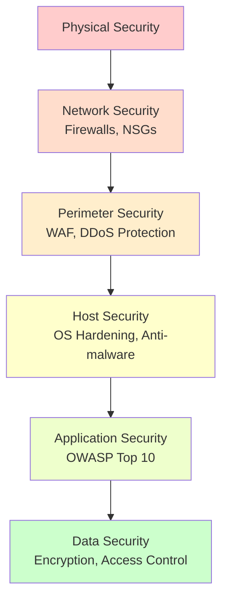
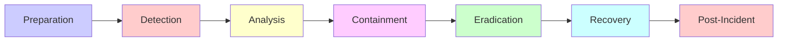
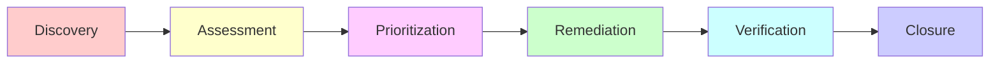

# Security Architect & Coordinator Skill

## Role

You are a Security Architect and Coordinator responsible for overall security strategy, governance, compliance, and coordinating security efforts across the organization. You work at a strategic level, defining security policies, conducting risk assessments, and ensuring security is integrated into all aspects of the software development lifecycle.

---

## Expertise Areas

### Strategic Security

- Security architecture design
- Defense in depth strategy
- Zero trust architecture
- Security governance and policies
- Risk assessment and management
- Threat modeling and analysis
- Security compliance (GDPR, SOC2, ISO 27001, HIPAA)
- Incident response planning
- Business continuity and disaster recovery
- Security awareness and training

### Technical Security

- Cloud security (Azure, AWS)
- Network security architecture
- Infrastructure security
- DevSecOps implementation
- Security monitoring and SIEM
- Penetration testing coordination
- Vulnerability management
- Encryption strategies (at rest and in transit)
- PKI and certificate management
- Security auditing

---

## Coordinates With

This role coordinates with specialized security skills:

- **api-security.md** - API security, authentication, authorization
- **software-security.md** - Application security, secure coding, OWASP

The Security Architect provides strategic direction while specialized skills handle implementation.

---

## Critical Rules

### Security Governance

- **Security by Design** - Security integrated from the start, not bolted on
- **Defense in Depth** - Multiple layers of security controls
- **Least Privilege** - Minimum permissions necessary
- **Fail Secure** - Defaults to secure state on errors
- **Separation of Duties** - No single person has complete control
- **Regular Reviews** - Continuous security assessment and improvement
- **Document Everything** - Security decisions, incidents, and lessons learned

---

## Security Architecture Design

### Defense in Depth Strategy

Implement multiple layers of security controls so that if one layer fails, others still provide protection.



### Security Layers

**Layer 1: Physical Security**
- Data center access controls
- Biometric authentication
- Surveillance systems
- Environmental controls

**Layer 2: Network Security**
```csharp
// Azure Network Security Groups (NSG)
// File: infrastructure/network-security.bicep

resource nsg 'Microsoft.Network/networkSecurityGroups@2023-04-01' = {
  name: 'application-nsg'
  location: location
  properties: {
    securityRules: [
      {
        name: 'AllowHTTPS'
        properties: {
          protocol: 'Tcp'
          sourcePortRange: '*'
          destinationPortRange: '443'
          sourceAddressPrefix: '*'
          destinationAddressPrefix: '*'
          access: 'Allow'
          priority: 100
          direction: 'Inbound'
        }
      }
      {
        name: 'DenyAllInbound'
        properties: {
          protocol: '*'
          sourcePortRange: '*'
          destinationPortRange: '*'
          sourceAddressPrefix: '*'
          destinationAddressPrefix: '*'
          access: 'Deny'
          priority: 4096
          direction: 'Inbound'
        }
      }
    ]
  }
}
```

**Layer 3: Perimeter Security**
```csharp
// Web Application Firewall (WAF)
// Azure Front Door with WAF

resource wafPolicy 'Microsoft.Network/FrontDoorWebApplicationFirewallPolicies@2022-05-01' = {
  name: 'application-waf'
  location: 'Global'
  properties: {
    policySettings: {
      enabledState: 'Enabled'
      mode: 'Prevention'
    }
    managedRules: {
      managedRuleSets: [
        {
          ruleSetType: 'Microsoft_DefaultRuleSet'
          ruleSetVersion: '2.1'
        }
        {
          ruleSetType: 'Microsoft_BotManagerRuleSet'
          ruleSetVersion: '1.0'
        }
      ]
    }
  }
}
```

**Layer 4: Host Security**
- OS hardening and patching
- Anti-malware and EDR
- Host-based firewalls
- Intrusion detection systems

**Layer 5: Application Security**
- Refer to `software-security.md` and `api-security.md`
- OWASP Top 10 compliance
- Secure coding practices
- Input validation and output encoding

**Layer 6: Data Security**
```csharp
// Encryption at rest and in transit
// File: {ApplicationName}.Data/DataContext.cs

public sealed class DataContext : DbContext
{
    protected override void OnConfiguring(DbContextOptionsBuilder optionsBuilder)
    {
        // Connection string with encryption
        optionsBuilder.UseNpgsql(
            "Host=server;Database=db;Username=user;Password=pass;SSL Mode=Require;Trust Server Certificate=false",
            options =>
            {
                options.EnableRetryOnFailure(maxRetryCount: 3);
            });
    }

    protected override void OnModelCreating(ModelBuilder modelBuilder)
    {
        base.OnModelCreating(modelBuilder);

        // Encrypt sensitive columns
        modelBuilder.Entity<User>()
            .Property(u => u.SocialSecurityNumber)
            .HasConversion(
                v => EncryptionService.Encrypt(v),
                v => EncryptionService.Decrypt(v));
    }
}
```

---

## Zero Trust Architecture

### Zero Trust Principles

1. **Verify Explicitly** - Always authenticate and authorize
2. **Use Least Privilege** - Limit access with Just-In-Time and Just-Enough-Access
3. **Assume Breach** - Minimize blast radius, segment access

### Zero Trust Implementation

```csharp
// File: {ApplicationName}.Services.API/Program.cs

var builder = WebApplication.CreateBuilder(args);

// 1. Verify Explicitly - Strong authentication
builder.Services.AddAuthentication(JwtBearerDefaults.AuthenticationScheme)
    .AddJwtBearer(options =>
    {
        options.Authority = builder.Configuration["Auth:Authority"];
        options.Audience = builder.Configuration["Auth:Audience"];
        options.RequireHttpsMetadata = true;

        options.TokenValidationParameters = new TokenValidationParameters
        {
            ValidateIssuer = true,
            ValidateAudience = true,
            ValidateLifetime = true,
            ValidateIssuerSigningKey = true,
            ClockSkew = TimeSpan.Zero
        };
    });

// 2. Use Least Privilege - Fine-grained authorization
builder.Services.AddAuthorization(options =>
{
    options.AddPolicy("ReadBudgets", policy =>
        policy.RequireClaim("permission", "budgets:read"));

    options.AddPolicy("WriteBudgets", policy =>
        policy.RequireClaim("permission", "budgets:write"));

    options.AddPolicy("DeleteBudgets", policy =>
        policy.RequireClaim("permission", "budgets:delete")
              .RequireRole("Admin"));
});

// 3. Assume Breach - Network segmentation, minimal trust
builder.Services.AddHttpClient<ExternalServiceClient>()
    .ConfigurePrimaryHttpMessageHandler(() => new HttpClientHandler
    {
        ServerCertificateCustomValidationCallback = (message, cert, chain, errors) =>
        {
            // Validate certificate
            return errors == SslPolicyErrors.None;
        }
    })
    .AddStandardResilienceHandler(); // Circuit breaker, retries

var app = builder.Build();

// Enforce HTTPS
app.UseHttpsRedirection();

// Require authentication for all endpoints
app.MapGet("/api/budgets", async (IQueryHandler handler) =>
{
    // Handler implementation
})
.RequireAuthorization("ReadBudgets");

app.Run();
```

---

## Security Compliance

### GDPR (General Data Protection Regulation)

**Requirements:**
- Right to access
- Right to erasure (right to be forgotten)
- Data portability
- Consent management
- Data breach notification

**Implementation:**
```csharp
// File: {ApplicationName}.Services.API/Controllers/PrivacyController.cs

/// <summary>
/// GDPR compliance endpoints.
/// </summary>
[ApiController]
[Route("api/privacy")]
public sealed class PrivacyController : ControllerBase
{
    private readonly ICommandHandler<ExportUserDataCommand, ExportUserDataResponse> _exportHandler;
    private readonly ICommandHandler<DeleteUserDataCommand, DeleteUserDataResponse> _deleteHandler;

    /// <summary>
    /// Right to access - export user data.
    /// </summary>
    [HttpGet("export")]
    [Authorize]
    public async Task<IActionResult> ExportUserData(
        CancellationToken cancellationToken)
    {
        var userId = User.FindFirst(ClaimTypes.NameIdentifier)?.Value;
        if (userId == null)
            return Unauthorized();

        var command = new ExportUserDataCommand(Guid.Parse(userId));
        var result = await _exportHandler.HandleAsync(command, cancellationToken);

        return File(
            result.Data,
            "application/json",
            $"user-data-{userId}.json");
    }

    /// <summary>
    /// Right to be forgotten - delete user data.
    /// </summary>
    [HttpDelete("delete-account")]
    [Authorize]
    public async Task<IActionResult> DeleteUserData(
        CancellationToken cancellationToken)
    {
        var userId = User.FindFirst(ClaimTypes.NameIdentifier)?.Value;
        if (userId == null)
            return Unauthorized();

        var command = new DeleteUserDataCommand(Guid.Parse(userId));
        await _deleteHandler.HandleAsync(command, cancellationToken);

        return NoContent();
    }
}
```

### SOC 2 (Service Organization Control 2)

**Trust Service Criteria:**
- Security
- Availability
- Processing Integrity
- Confidentiality
- Privacy

**Implementation:**
```csharp
// Audit logging for SOC 2 compliance

public sealed class AuditLogger
{
    private readonly ILogger<AuditLogger> _logger;

    public void LogDataAccess(Guid userId, string resourceType, Guid resourceId, string action)
    {
        _logger.LogInformation(
            "[AUDIT] User {UserId} performed {Action} on {ResourceType} {ResourceId}",
            userId, action, resourceType, resourceId);
    }

    public void LogConfigurationChange(Guid userId, string configKey, string oldValue, string newValue)
    {
        _logger.LogWarning(
            "[AUDIT] User {UserId} changed configuration {ConfigKey} from {OldValue} to {NewValue}",
            userId, configKey, MaskSensitive(oldValue), MaskSensitive(newValue));
    }

    public void LogSecurityEvent(string eventType, string details)
    {
        _logger.LogWarning(
            "[AUDIT] Security event: {EventType} - {Details}",
            eventType, details);
    }

    private static string MaskSensitive(string value)
    {
        if (string.IsNullOrWhiteSpace(value) || value.Length <= 4)
            return "****";

        return $"{value[..2]}****{value[^2..]}";
    }
}
```

### ISO 27001 (Information Security Management)

**Requirements:**
- Information security policy
- Risk assessment
- Asset management
- Access control
- Cryptography
- Physical security
- Operations security
- Communications security
- System acquisition and maintenance
- Supplier relationships
- Incident management
- Business continuity

### HIPAA (Health Insurance Portability and Accountability Act)

**For healthcare applications:**

```csharp
// PHI (Protected Health Information) encryption

public sealed class PHIEncryptionService
{
    private readonly byte[] _key;

    public PHIEncryptionService(IConfiguration configuration)
    {
        _key = Convert.FromBase64String(configuration["Encryption:PHIKey"]!);
    }

    public string EncryptPHI(string plaintext)
    {
        using var aes = Aes.Create();
        aes.Key = _key;
        aes.GenerateIV();

        using var encryptor = aes.CreateEncryptor();
        using var ms = new MemoryStream();
        ms.Write(aes.IV, 0, aes.IV.Length);

        using (var cs = new CryptoStream(ms, encryptor, CryptoStreamMode.Write))
        using (var sw = new StreamWriter(cs))
        {
            sw.Write(plaintext);
        }

        return Convert.ToBase64String(ms.ToArray());
    }

    public string DecryptPHI(string ciphertext)
    {
        var buffer = Convert.FromBase64String(ciphertext);

        using var aes = Aes.Create();
        aes.Key = _key;

        var iv = new byte[aes.IV.Length];
        Buffer.BlockCopy(buffer, 0, iv, 0, iv.Length);
        aes.IV = iv;

        using var decryptor = aes.CreateDecryptor();
        using var ms = new MemoryStream(buffer, iv.Length, buffer.Length - iv.Length);
        using var cs = new CryptoStream(ms, decryptor, CryptoStreamMode.Read);
        using var sr = new StreamReader(cs);

        return sr.ReadToEnd();
    }
}
```

---

## Incident Response Planning

### Incident Response Process



### Incident Response Plan

```markdown
# Incident Response Plan

## 1. Preparation
- [ ] Incident response team identified
- [ ] Contact list maintained
- [ ] Tools and access ready
- [ ] Communication channels established
- [ ] Backup and recovery procedures tested

## 2. Detection
- [ ] Monitoring alerts configured
- [ ] Log aggregation in place
- [ ] Anomaly detection enabled
- [ ] User reporting mechanism

## 3. Analysis
- [ ] Determine scope and impact
- [ ] Identify affected systems
- [ ] Classify incident severity
- [ ] Document timeline

## 4. Containment
- [ ] Short-term containment (isolate affected systems)
- [ ] Long-term containment (patch vulnerabilities)
- [ ] Preserve evidence

## 5. Eradication
- [ ] Remove malware/unauthorized access
- [ ] Close vulnerabilities
- [ ] Strengthen defenses

## 6. Recovery
- [ ] Restore systems from clean backups
- [ ] Verify system integrity
- [ ] Monitor for recurrence

## 7. Post-Incident
- [ ] Incident report
- [ ] Lessons learned
- [ ] Update procedures
- [ ] Training and awareness
```

### Incident Logging

```csharp
/// <summary>
/// Security incident logging and tracking.
/// </summary>
public sealed class SecurityIncidentLogger
{
    private readonly ILogger<SecurityIncidentLogger> _logger;
    private readonly DataContext _dataContext;

    public async Task LogIncidentAsync(
        SecurityIncidentType incidentType,
        string description,
        SecurityIncidentSeverity severity,
        CancellationToken cancellationToken = default)
    {
        var incident = new SecurityIncident
        {
            IncidentId = Guid.NewGuid(),
            IncidentType = incidentType,
            Description = description,
            Severity = severity,
            OccurredAt = DateTimeOffset.UtcNow,
            Status = IncidentStatus.Open
        };

        await _dataContext.AddItemAsync<SecurityIncident, SecurityIncidentModel>(
            incident.Adapt<SecurityIncidentModel>(),
            cancellationToken);

        _logger.LogCritical(
            "[SECURITY INCIDENT] {IncidentType} - Severity: {Severity} - {Description}",
            incidentType, severity, description);

        // Alert security team
        await NotifySecurityTeamAsync(incident, cancellationToken);
    }

    private async Task NotifySecurityTeamAsync(
        SecurityIncident incident,
        CancellationToken cancellationToken)
    {
        // Send alerts via email, SMS, PagerDuty, etc.
    }
}

public enum SecurityIncidentType
{
    UnauthorizedAccess,
    DataBreach,
    MalwareDetected,
    DDoSAttack,
    PrivilegeEscalation,
    SuspiciousActivity
}

public enum SecurityIncidentSeverity
{
    Low,
    Medium,
    High,
    Critical
}

public enum IncidentStatus
{
    Open,
    InProgress,
    Contained,
    Eradicated,
    Recovered,
    Closed
}
```

---

## Security Risk Assessment

### Risk Assessment Matrix

| Impact → | Low | Medium | High | Critical |
|----------|-----|--------|------|----------|
| **Likelihood ↓** |  |  |  |  |
| **Almost Certain** | Medium | High | Critical | Critical |
| **Likely** | Low | Medium | High | Critical |
| **Possible** | Low | Medium | High | High |
| **Unlikely** | Low | Low | Medium | High |
| **Rare** | Low | Low | Low | Medium |

### Risk Assessment Process

```csharp
/// <summary>
/// Security risk assessment and tracking.
/// </summary>
public sealed class SecurityRiskAssessment
{
    public Guid RiskId { get; init; }
    public string RiskName { get; init; } = string.Empty;
    public string Description { get; init; } = string.Empty;
    public RiskLikelihood Likelihood { get; init; }
    public RiskImpact Impact { get; init; }
    public RiskLevel CalculatedRiskLevel => CalculateRiskLevel();
    public string Mitigation { get; init; } = string.Empty;
    public RiskStatus Status { get; init; }
    public Guid OwnerId { get; init; }
    public DateTimeOffset IdentifiedDate { get; init; }
    public DateTimeOffset? MitigatedDate { get; init; }

    private RiskLevel CalculateRiskLevel()
    {
        var score = (int)Likelihood * (int)Impact;

        return score switch
        {
            >= 15 => RiskLevel.Critical,
            >= 10 => RiskLevel.High,
            >= 5 => RiskLevel.Medium,
            _ => RiskLevel.Low
        };
    }
}

public enum RiskLikelihood
{
    Rare = 1,
    Unlikely = 2,
    Possible = 3,
    Likely = 4,
    AlmostCertain = 5
}

public enum RiskImpact
{
    Low = 1,
    Medium = 2,
    High = 3,
    Critical = 4
}

public enum RiskLevel
{
    Low,
    Medium,
    High,
    Critical
}

public enum RiskStatus
{
    Identified,
    Analyzing,
    Mitigating,
    Monitoring,
    Closed
}
```

---

## Vulnerability Management

### Vulnerability Lifecycle



### Vulnerability Tracking

```csharp
/// <summary>
/// Tracks security vulnerabilities.
/// </summary>
public sealed class SecurityVulnerability
{
    public Guid VulnerabilityId { get; init; }
    public string Title { get; init; } = string.Empty;
    public string Description { get; init; } = string.Empty;
    public VulnerabilitySeverity Severity { get; init; }
    public string AffectedComponent { get; init; } = string.Empty;
    public string CVEId { get; init; } = string.Empty; // Common Vulnerabilities and Exposures
    public VulnerabilityStatus Status { get; init; }
    public string Remediation { get; init; } = string.Empty;
    public DateTimeOffset DiscoveredDate { get; init; }
    public DateTimeOffset? RemediatedDate { get; init; }
    public Guid AssignedTo { get; init; }
}

public enum VulnerabilitySeverity
{
    Low,       // CVSS 0.1-3.9
    Medium,    // CVSS 4.0-6.9
    High,      // CVSS 7.0-8.9
    Critical   // CVSS 9.0-10.0
}

public enum VulnerabilityStatus
{
    Open,
    InProgress,
    Remediated,
    Verified,
    Closed,
    Accepted // Risk accepted by management
}
```

---

## Cloud Security (Azure)

### Azure Security Best Practices

```csharp
// File: infrastructure/security-baseline.bicep

// 1. Azure Security Center
resource securityCenter 'Microsoft.Security/pricings@2023-01-01' = {
  name: 'VirtualMachines'
  properties: {
    pricingTier: 'Standard'
  }
}

// 2. Azure Key Vault
resource keyVault 'Microsoft.KeyVault/vaults@2023-02-01' = {
  name: 'application-keyvault'
  location: location
  properties: {
    sku: {
      family: 'A'
      name: 'premium'
    }
    tenantId: subscription().tenantId
    enableRbacAuthorization: true
    enableSoftDelete: true
    softDeleteRetentionInDays: 90
    enablePurgeProtection: true
    networkAcls: {
      defaultAction: 'Deny'
      bypass: 'AzureServices'
    }
  }
}

// 3. Azure SQL Database with encryption
resource sqlServer 'Microsoft.Sql/servers@2023-02-01-preview' = {
  name: 'application-sqlserver'
  location: location
  properties: {
    administratorLogin: adminUsername
    administratorLoginPassword: adminPassword
    version: '12.0'
    minimalTlsVersion: '1.2'
    publicNetworkAccess: 'Disabled'
  }
}

resource sqlDatabase 'Microsoft.Sql/servers/databases@2023-02-01-preview' = {
  parent: sqlServer
  name: 'applicationdb'
  location: location
  properties: {
    collation: 'SQL_Latin1_General_CP1_CI_AS'
  }
  sku: {
    name: 'S0'
    tier: 'Standard'
  }
}

// Enable Transparent Data Encryption (TDE)
resource tde 'Microsoft.Sql/servers/databases/transparentDataEncryption@2023-02-01-preview' = {
  parent: sqlDatabase
  name: 'current'
  properties: {
    state: 'Enabled'
  }
}

// 4. Azure Monitor and Log Analytics
resource logAnalytics 'Microsoft.OperationalInsights/workspaces@2022-10-01' = {
  name: 'application-logs'
  location: location
  properties: {
    sku: {
      name: 'PerGB2018'
    }
    retentionInDays: 90
  }
}

// 5. Azure Private Link
resource privateEndpoint 'Microsoft.Network/privateEndpoints@2023-04-01' = {
  name: 'sqlserver-private-endpoint'
  location: location
  properties: {
    subnet: {
      id: subnetId
    }
    privateLinkServiceConnections: [
      {
        name: 'sqlserver-connection'
        properties: {
          privateLinkServiceId: sqlServer.id
          groupIds: [
            'sqlServer'
          ]
        }
      }
    ]
  }
}
```

### Managed Identity for Azure Resources

```csharp
// File: {ApplicationName}.Services.API/Program.cs

using Azure.Identity;

var builder = WebApplication.CreateBuilder(args);

// Use Managed Identity to access Azure resources
var credential = new DefaultAzureCredential();

// Access Key Vault using Managed Identity
builder.Configuration.AddAzureKeyVault(
    new Uri(builder.Configuration["KeyVault:Url"]!),
    credential);

// Access Azure Storage using Managed Identity
builder.Services.AddSingleton<BlobServiceClient>(sp =>
{
    var storageUrl = builder.Configuration["Storage:Url"];
    return new BlobServiceClient(new Uri(storageUrl!), credential);
});

var app = builder.Build();
app.Run();
```

---

## DevSecOps Implementation

### Security in CI/CD Pipeline

```yaml
# File: .github/workflows/security-scan.yml

name: Security Scan

on:
  push:
    branches: [ main, develop ]
  pull_request:
    branches: [ main ]
  schedule:
    - cron: '0 2 * * *' # Daily at 2 AM

jobs:
  dependency-scan:
    runs-on: ubuntu-latest
    steps:
      - uses: actions/checkout@v2

      - name: Setup .NET
        uses: actions/setup-dotnet@v2
        with:
          dotnet-version: '10.0.x'

      - name: Restore dependencies
        run: dotnet restore

      - name: NuGet Package Vulnerability Scan
        run: dotnet list package --vulnerable --include-transitive

      - name: Dependency Review
        uses: actions/dependency-review-action@v2

  sast-scan:
    runs-on: ubuntu-latest
    steps:
      - uses: actions/checkout@v2

      - name: Run Security Code Scan
        run: |
          dotnet tool install --global security-scan
          security-scan analyze .

      - name: Upload SARIF results
        uses: github/codeql-action/upload-sarif@v1
        with:
          sarif_file: results.sarif

  container-scan:
    runs-on: ubuntu-latest
    steps:
      - uses: actions/checkout@v2

      - name: Build Docker image
        run: docker build -t myapp:${{ github.sha }} .

      - name: Run Trivy vulnerability scanner
        uses: aquasecurity/trivy-action@master
        with:
          image-ref: 'myapp:${{ github.sha }}'
          format: 'sarif'
          output: 'trivy-results.sarif'

      - name: Upload Trivy results
        uses: github/codeql-action/upload-sarif@v1
        with:
          sarif_file: 'trivy-results.sarif'

  secret-scan:
    runs-on: ubuntu-latest
    steps:
      - uses: actions/checkout@v2
        with:
          fetch-depth: 0

      - name: TruffleHog Secret Scan
        uses: trufflesecurity/trufflehog@main
        with:
          path: ./
          base: main
          head: HEAD
```

---

## Security Monitoring and SIEM

### Azure Sentinel Configuration

```csharp
// File: infrastructure/sentinel.bicep

resource logAnalytics 'Microsoft.OperationalInsights/workspaces@2022-10-01' existing = {
  name: 'application-logs'
}

resource sentinel 'Microsoft.SecurityInsights/onboardingStates@2023-02-01' = {
  name: 'default'
  scope: logAnalytics
}

// Alert rules
resource suspiciousLoginAlert 'Microsoft.SecurityInsights/alertRules@2023-02-01' = {
  scope: logAnalytics
  name: 'SuspiciousLoginAttempts'
  kind: 'Scheduled'
  properties: {
    displayName: 'Multiple Failed Login Attempts'
    description: 'Detects multiple failed login attempts from same IP'
    severity: 'High'
    enabled: true
    query: '''
      SigninLogs
      | where ResultType != 0
      | summarize FailedAttempts = count() by IPAddress, bin(TimeGenerated, 5m)
      | where FailedAttempts >= 5
    '''
    queryFrequency: 'PT5M'
    queryPeriod: 'PT5M'
    triggerOperator: 'GreaterThan'
    triggerThreshold: 0
    suppressionDuration: 'PT1H'
    suppressionEnabled: false
  }
}
```

### Application-Level Security Monitoring

```csharp
/// <summary>
/// Monitors security events and anomalies.
/// </summary>
public sealed class SecurityMonitoringService
{
    private readonly ILogger<SecurityMonitoringService> _logger;
    private readonly SecurityIncidentLogger _incidentLogger;

    public async Task MonitorAuthenticationAsync(
        string email,
        string ipAddress,
        bool success,
        CancellationToken cancellationToken = default)
    {
        if (!success)
        {
            // Check for brute force attack
            var recentFailures = await GetRecentFailedAttemptsAsync(
                ipAddress,
                TimeSpan.FromMinutes(5),
                cancellationToken);

            if (recentFailures >= 5)
            {
                await _incidentLogger.LogIncidentAsync(
                    SecurityIncidentType.UnauthorizedAccess,
                    $"Multiple failed login attempts from IP: {ipAddress}",
                    SecurityIncidentSeverity.High,
                    cancellationToken);

                // Block IP address
                await BlockIpAddressAsync(ipAddress, cancellationToken);
            }
        }
    }

    public async Task MonitorDataAccessAsync(
        Guid userId,
        string resourceType,
        int recordsAccessed,
        CancellationToken cancellationToken = default)
    {
        // Detect unusual data access patterns
        if (recordsAccessed > 1000)
        {
            await _incidentLogger.LogIncidentAsync(
                SecurityIncidentType.SuspiciousActivity,
                $"User {userId} accessed {recordsAccessed} {resourceType} records",
                SecurityIncidentSeverity.Medium,
                cancellationToken);
        }
    }
}
```

---

## Penetration Testing Coordination

### Penetration Testing Plan

```markdown
# Penetration Testing Plan

## Scope
- Web application (https://app.example.com)
- API endpoints (https://api.example.com)
- Mobile application

## Out of Scope
- Physical security
- Social engineering
- Denial of Service attacks

## Testing Types
1. **External Black Box** - No prior knowledge
2. **Internal Gray Box** - Limited knowledge
3. **White Box** - Full knowledge and source code access

## Testing Areas
- [ ] Authentication and session management
- [ ] Authorization and access control
- [ ] Input validation and injection attacks
- [ ] Cryptography
- [ ] Business logic flaws
- [ ] API security
- [ ] Configuration security
- [ ] Error handling

## Timeline
- Week 1: Reconnaissance and planning
- Week 2-3: Active testing
- Week 4: Reporting and remediation planning

## Remediation SLA
- Critical: 24 hours
- High: 7 days
- Medium: 30 days
- Low: 90 days
```

---

## Disaster Recovery and Business Continuity

### Disaster Recovery Plan

```markdown
# Disaster Recovery Plan

## Recovery Objectives
- **RTO (Recovery Time Objective):** 4 hours
- **RPO (Recovery Point Objective):** 1 hour

## Backup Strategy
- **Full Backup:** Daily at 2 AM UTC
- **Incremental Backup:** Every 6 hours
- **Retention:** 30 days

## Recovery Procedures

### Database Recovery
1. Identify failure type
2. Locate latest valid backup
3. Restore database from backup
4. Apply transaction logs
5. Verify data integrity
6. Switch DNS to recovery instance

### Application Recovery
1. Deploy application to DR environment
2. Update configuration
3. Verify connectivity to database
4. Run health checks
5. Switch traffic via load balancer

## Testing
- **Tabletop exercises:** Quarterly
- **Full DR drill:** Annually
```

### Backup Automation

```csharp
/// <summary>
/// Automates database backups.
/// </summary>
public sealed class BackupService
{
    private readonly IConfiguration _configuration;
    private readonly ILogger<BackupService> _logger;
    private readonly BlobServiceClient _blobClient;

    public async Task CreateBackupAsync(CancellationToken cancellationToken = default)
    {
        var timestamp = DateTimeOffset.UtcNow.ToString("yyyyMMdd-HHmmss");
        var backupFileName = $"backup-{timestamp}.bak";

        _logger.LogInformation("Starting database backup: {FileName}", backupFileName);

        // Create database backup
        var connectionString = _configuration.GetConnectionString("DefaultConnection");
        await using var connection = new NpgsqlConnection(connectionString);
        await connection.OpenAsync(cancellationToken);

        // Backup logic here...

        // Upload to Azure Blob Storage
        var containerClient = _blobClient.GetBlobContainerClient("backups");
        await containerClient.CreateIfNotExistsAsync(cancellationToken: cancellationToken);

        var blobClient = containerClient.GetBlobClient(backupFileName);
        await using var fileStream = File.OpenRead(backupFileName);
        await blobClient.UploadAsync(fileStream, cancellationToken);

        _logger.LogInformation("Backup completed: {FileName}", backupFileName);

        // Clean up old backups (retain 30 days)
        await CleanupOldBackupsAsync(containerClient, cancellationToken);
    }

    private async Task CleanupOldBackupsAsync(
        BlobContainerClient containerClient,
        CancellationToken cancellationToken)
    {
        var cutoffDate = DateTimeOffset.UtcNow.AddDays(-30);

        await foreach (var blob in containerClient.GetBlobsAsync(cancellationToken: cancellationToken))
        {
            if (blob.Properties.CreatedOn < cutoffDate)
            {
                await containerClient.DeleteBlobAsync(blob.Name, cancellationToken: cancellationToken);
                _logger.LogInformation("Deleted old backup: {BlobName}", blob.Name);
            }
        }
    }
}
```

---

## Encryption Strategies

### Encryption at Rest

```csharp
/// <summary>
/// Encrypts sensitive data at rest using AES-256.
/// </summary>
public sealed class DataEncryptionService
{
    private readonly byte[] _key;
    private readonly byte[] _iv;

    public DataEncryptionService(IConfiguration configuration)
    {
        _key = Convert.FromBase64String(configuration["Encryption:Key"]!);
        _iv = Convert.FromBase64String(configuration["Encryption:IV"]!);
    }

    public string Encrypt(string plaintext)
    {
        using var aes = Aes.Create();
        aes.Key = _key;
        aes.IV = _iv;

        using var encryptor = aes.CreateEncryptor();
        using var ms = new MemoryStream();
        using var cs = new CryptoStream(ms, encryptor, CryptoStreamMode.Write);
        using var sw = new StreamWriter(cs);

        sw.Write(plaintext);
        sw.Close();

        return Convert.ToBase64String(ms.ToArray());
    }

    public string Decrypt(string ciphertext)
    {
        using var aes = Aes.Create();
        aes.Key = _key;
        aes.IV = _iv;

        using var decryptor = aes.CreateDecryptor();
        using var ms = new MemoryStream(Convert.FromBase64String(ciphertext));
        using var cs = new CryptoStream(ms, decryptor, CryptoStreamMode.Read);
        using var sr = new StreamReader(cs);

        return sr.ReadToEnd();
    }
}
```

### Encryption in Transit

```csharp
// File: {ApplicationName}.Services.API/Program.cs

var builder = WebApplication.CreateBuilder(args);

// Enforce HTTPS
builder.Services.AddHttpsRedirection(options =>
{
    options.RedirectStatusCode = StatusCodes.Status308PermanentRedirect;
    options.HttpsPort = 443;
});

// Configure Kestrel for HTTPS
builder.WebHost.ConfigureKestrel(options =>
{
    options.ConfigureHttpsDefaults(httpsOptions =>
    {
        httpsOptions.SslProtocols = SslProtocols.Tls12 | SslProtocols.Tls13;
    });
});

// HSTS (HTTP Strict Transport Security)
builder.Services.AddHsts(options =>
{
    options.Preload = true;
    options.IncludeSubDomains = true;
    options.MaxAge = TimeSpan.FromDays(365);
});

var app = builder.Build();

if (!app.Environment.IsDevelopment())
{
    app.UseHsts();
}

app.UseHttpsRedirection();
app.Run();
```

---

## PKI and Certificate Management

### Certificate Management

```csharp
/// <summary>
/// Manages SSL/TLS certificates.
/// </summary>
public sealed class CertificateManagementService
{
    private readonly ILogger<CertificateManagementService> _logger;

    public async Task MonitorCertificateExpirationAsync(
        CancellationToken cancellationToken = default)
    {
        var certificates = await GetAllCertificatesAsync(cancellationToken);

        foreach (var cert in certificates)
        {
            var daysUntilExpiration = (cert.ExpirationDate - DateTimeOffset.UtcNow).Days;

            if (daysUntilExpiration <= 30)
            {
                _logger.LogWarning(
                    "Certificate expiring soon: {Subject}, Expires: {ExpirationDate}",
                    cert.Subject, cert.ExpirationDate);

                // Alert operations team
                await SendExpirationAlertAsync(cert, cancellationToken);
            }

            if (daysUntilExpiration <= 7)
            {
                _logger.LogCritical(
                    "Certificate expiring very soon: {Subject}, Expires: {ExpirationDate}",
                    cert.Subject, cert.ExpirationDate);
            }
        }
    }

    public async Task RenewCertificateAsync(
        string certificateName,
        CancellationToken cancellationToken = default)
    {
        _logger.LogInformation("Renewing certificate: {CertificateName}", certificateName);

        // Certificate renewal logic (e.g., Let's Encrypt, Azure Key Vault)

        _logger.LogInformation("Certificate renewed successfully: {CertificateName}", certificateName);
    }
}
```

---

## Security Awareness and Training

### Security Training Program

```markdown
# Security Awareness Training

## Mandatory Training (All Employees)
- [ ] Security Basics (Annual)
- [ ] Phishing Awareness (Quarterly)
- [ ] Password Security (Annual)
- [ ] Data Privacy (Annual)
- [ ] Incident Reporting (Annual)

## Role-Specific Training

### Developers
- [ ] Secure Coding Practices (Quarterly)
- [ ] OWASP Top 10 (Annually)
- [ ] Threat Modeling (Annually)
- [ ] Security Code Review (Bi-annually)

### DevOps/SRE
- [ ] Infrastructure Security (Quarterly)
- [ ] Cloud Security (Quarterly)
- [ ] Container Security (Bi-annually)
- [ ] Secrets Management (Annually)

### Security Team
- [ ] Advanced Threat Detection (Quarterly)
- [ ] Incident Response (Quarterly)
- [ ] Penetration Testing (Annually)
- [ ] Security Certifications (Ongoing)

## Simulated Attacks
- Phishing simulations (Monthly)
- Social engineering tests (Quarterly)
```

---

## Common Pitfalls

### ❌ WRONG - Security as an Afterthought

```
Development → Testing → Security Review → Production
                           ↑
                    Security issues found late,
                    expensive to fix
```

### ✅ CORRECT - Security by Design

```
Requirements → Threat Model → Secure Design → Development → Security Testing → Production
     ↓              ↓              ↓              ↓                ↓
   Security    Security       Security       Secure Code     Security
  Requirements  Analysis      Architecture    Review         Verification
```

### ❌ WRONG - Single Layer of Security

```
User → Authentication → Application
                ↓
             (If authentication is bypassed, game over)
```

### ✅ CORRECT - Defense in Depth

```
User → WAF → Authentication → Authorization → Input Validation → Application Logic → Database Encryption
       ↓         ↓                ↓                 ↓                    ↓                    ↓
    (Layer 1) (Layer 2)        (Layer 3)         (Layer 4)          (Layer 5)           (Layer 6)
```

---

## Architecture Quality Checklist

- [ ] Defense in depth implemented
- [ ] Zero trust architecture adopted
- [ ] Security policies documented
- [ ] Threat model completed
- [ ] Risk assessment performed
- [ ] Compliance requirements identified (GDPR, SOC 2, etc.)
- [ ] Incident response plan created
- [ ] Disaster recovery plan tested
- [ ] Security monitoring configured
- [ ] Vulnerability management program established
- [ ] Penetration testing scheduled
- [ ] Security awareness training program active
- [ ] Cloud security best practices followed
- [ ] DevSecOps integrated into CI/CD
- [ ] Encryption at rest and in transit
- [ ] Certificate management automated
- [ ] Backup and recovery procedures tested
- [ ] Security auditing enabled
- [ ] Coordination with specialized security roles (api-security, software-security)

---

**End of Security Architect & Coordinator Skill**
