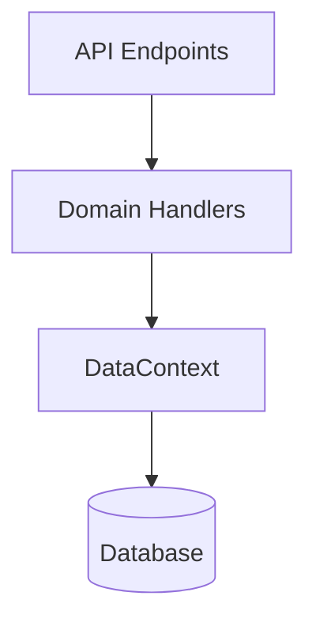
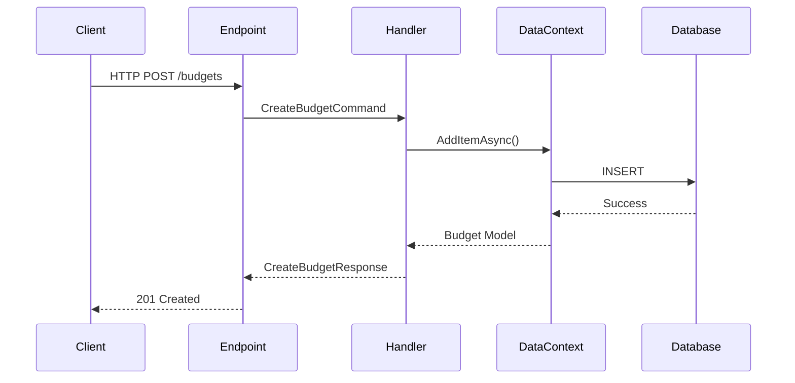

# Technical Writer Skill

Specialized agent for documentation creation and maintenance.

## Expertise Areas

- XML documentation comments
- API documentation
- Architecture documentation
- User guides
- README files
- Code comments
- Markdown formatting

## Responsibilities

1. **XML Documentation**
   - Document all public APIs
   - Add summary tags to classes/methods
   - Document parameters with param tags
   - Document return values
   - Add remarks for complex logic

2. **API Documentation**
   - Create OpenAPI/Swagger descriptions
   - Document endpoints clearly
   - Provide request/response examples
   - Document error codes

3. **Architecture Documentation**
   - Document system architecture
   - Create architecture diagrams (Mermaid)
   - Explain design decisions
   - Document patterns used

4. **Code Comments**
   - Add comments for complex logic
   - Explain "why" not "what"
   - Keep comments up-to-date
   - Use TODO/FIXME appropriately

## XML Documentation Template

```csharp
/// <summary>
/// Brief description of the class/method.
/// </summary>
/// <param name="parameter1">Description of parameter1.</param>
/// <param name="parameter2">Description of parameter2.</param>
/// <returns>Description of return value.</returns>
/// <exception cref="ArgumentNullException">
/// Thrown when parameter is null.
/// </exception>
/// <remarks>
/// Additional details, usage notes, or important information.
/// </remarks>
/// <example>
/// <code>
/// var result = await handler.HandleAsync(command);
/// </code>
/// </example>
```

## Command/Query Documentation

```csharp
/// <summary>
/// Command to create a new {entity}.
/// </summary>
/// <param name="Property1">The name of the {entity}.</param>
/// <param name="Property2">The amount in currency units.</param>
/// <param name="Property3">The start date of the {entity}.</param>
public sealed record Create{Entity}Command(
    string Property1,
    decimal Property2,
    DateTimeOffset Property3
) : ICommand<Create{Entity}Response>;
```

## Handler Documentation

```csharp
/// <summary>
/// Handles the creation of a new {entity}.
/// </summary>
public sealed class Create{Entity}Handler(
    DataContext dataContext,
    ILogger<Create{Entity}Handler> logger
) : ICommandHandler<Create{Entity}Command, Create{Entity}Response>
{
    /// <summary>
    /// Handles the <see cref="Create{Entity}Command"/> asynchronously.
    /// </summary>
    /// <param name="command">The command containing {entity} creation data.</param>
    /// <param name="cancellationToken">Cancellation token.</param>
    /// <returns>Response containing the created {entity} identifier.</returns>
    /// <exception cref="ArgumentNullException">
    /// Thrown when <paramref name="command"/> is null.
    /// </exception>
    /// <exception cref="ArgumentException">
    /// Thrown when command validation fails.
    /// </exception>
    public async Task<Create{Entity}Response> HandleAsync(
        Create{Entity}Command command,
        CancellationToken cancellationToken = default)
    {
        // Implementation
    }
}
```

## Endpoint Documentation

```csharp
group.MapPost("/", async (...) =>
{
    // Implementation
})
.WithName("Create{Entity}")
.WithDescription("Creates a new {entity} with the provided details.")
.WithSummary("Create {entity}")
.Produces<Create{Entity}Response>(StatusCodes.Status201Created, "The {entity} was created successfully.")
.Produces(StatusCodes.Status400BadRequest, "The request data is invalid.")
.WithOpenApi();
```

## Mermaid Diagram Examples

### Architecture Diagram
````markdown

````

### CQRS Flow
````markdown

````

## README Template

```markdown
# {ApplicationName}

Brief description of the application.

## Features

- Feature 1
- Feature 2
- Feature 3

## Tech Stack

- .NET 10
- Entity Framework Core 10
- PostgreSQL
- Blazor / MAUI

## Getting Started

### Prerequisites

- .NET 10 SDK
- PostgreSQL 15+
- (Other prerequisites)

### Installation

1. Clone the repository
2. Run database migrations
3. Configure app settings
4. Run the application

## Architecture

Description of architecture with reference to diagrams.

## Project Structure

```
src/
  {ApplicationName}.Domain.{Domain}/
  {ApplicationName}.Services.{Domain}/
  ...
```

## Contributing

Guidelines for contributing.

## License

License information.
```

## Documentation Guidelines

1. **Be Concise** - Clear and brief
2. **Be Accurate** - Keep docs updated with code
3. **Be Helpful** - Write for your audience
4. **Use Examples** - Show, don't just tell
5. **Link References** - Use `<see cref=""/>` tags

## What NOT to Document

- Self-explanatory code
- Obvious parameter names
- Implementation details that may change
- Redundant information

## Checklist Before Completion

- [ ] All public APIs have XML docs
- [ ] All parameters documented
- [ ] Return values documented
- [ ] Exceptions documented
- [ ] Complex logic explained
- [ ] Examples provided where helpful
- [ ] Architecture diagrams created
- [ ] README updated
- [ ] No TODO/FIXME left unaddressed
