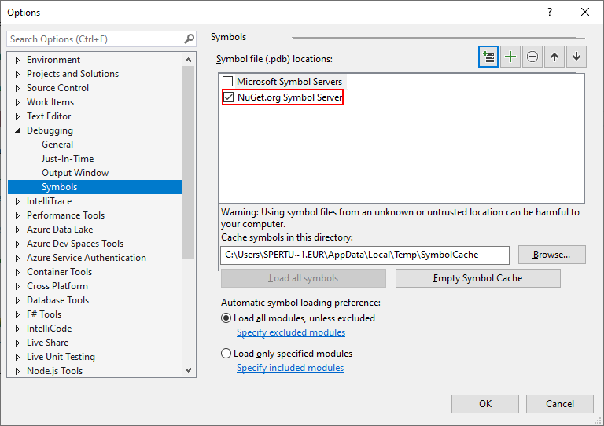
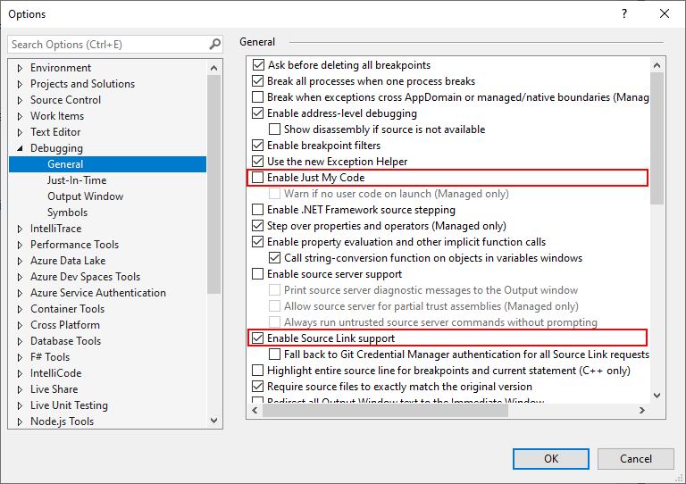

Debugging the synchronization framework
=============

Thanks to **Symbol files** and **Source Link**, we\'re able to debug the
**the synchronization framework** framework from within our application, without having to
donwload the source code locally.

To be able to **Step Into** the code, we should configure **Visual
Studio** to:

-   Download the symbol files from nuget if available.
-   Enable the source link to redirect the pdb information to the source
    code hosted on Github.

Once we\'ve correctly configured our Visual Studio environment, we are
able to **Step Into** the **the synchronization framework** code, during a debugging session (or
press **F11**):

As you can see in the previous screenshot, we are actually *step into*
the `SynchronizeAsync` method directly from your code.

Behinds the scene, the **.pdb file** retrieves the correct filename and
position and the **Source link** download the correct file from the [the synchronization framework
Github repository](https://www.github.com/I-Synergy/I-Synergy.Framework) .

Let\'s see in details how to configure your Visual Studio environment:

Symbols packages
----------------

> **Symbol files** (\*.pdb) are produced by the .NET compiler alongside
  assemblies.
> **Symbol files** map execution locations to the original source code
  so you can step through source code as it is running using a debugger.

**the synchronization framework** publishes the symbols packages, containing the .pdb files, for
each release to the nuget symbols server.

To be able to get the symbols, we should check we have **Nuget** as a
symbol server availabe from our Visual Studio options:

Go to **Tools** \> **Options** \> **Debugging** \> **Symbols**:

-   Verify we have **Nuget.Org Symbol** Servers checked.
-   Uncheck **Microsoft Symbol Servers**, unless we want also to debug
    the .NET Core assemblies from within our application.

> ### Hint
> If you don\'t have the Nuget.Org Symbol option, you can add this url
directly : <https://symbols.nuget.org/download/symbols>

> Now we are able to map the execution to the original source code
  location, but we still miss\... the source code itself !
> That\'s why need also the **Source link** options.

Source link
-----------

> **Source Link** is a technology that enables source code debugging of
  .NET assemblies from NuGet by developers.
> **Source Link** executes when creating the NuGet package and embeds
  source control metadata inside assemblies and the package.
> Developers who download the package and have **Source Link** enabled
  in Visual Studio can step into its source code.
> **Source Link** provides source control metadata to create a great
  debugging experience.

> ### Note
> More information on source link technology:
[SourceLink](https://github.com/dotnet/sourcelink/blob/master/README.md)

To be able to use the **Source link** technolgy, we should verify the
option is checked from within our Visual Studio options:

Go to **Tools** \> **Options** \> **Debugging** \> **General**:

-   Uncheck **Enable Just My Code**
-   Check **Enable Source Link support**

We can now debug our code, and **Step Into** the the synchronization framework code as well.

If you need more information, you can check this documentation: [Using
Pdb and Source
code](https://docs.microsoft.com/en-us/visualstudio/debugger/specify-symbol-dot-pdb-and-source-files-in-the-visual-studio-debugger?view=vs-2019)
