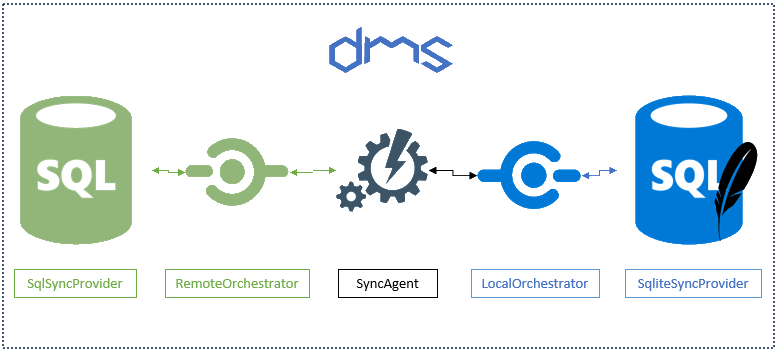

Welcome to the I-Synergy Synchronization Framework
======================

> ## Important
>
> This is a fork of the **[DMS](https://github.com/Mimetis/Dotmim.Sync)** repo where we made several adjustmenst for the I-Synergy framework.
> Big thanx to **[Sébastien Pertus](https://github.com/Mimetis)**
>
> In this initial version we only support SQL Server, Azure SQL, localDB and Sqlite databases.


**I-Synergy.Framework.Synchronization** (**the synchronization framework**) is a straightforward framework for syncing
relational databases, developed on top of **.Net Standard 2.0**,
available and ready to use within **IOT**, **Xamarin**, **.NET**, **.NET
Core**, **UWP** and so on :)

Available for syncing **SQL Server**, **MySQL**, **MariaDB** and
**Sqlite** databases.

> The source code is available on
> [Github](https://www.github.com/I-Synergy/I-Synergy.Framework).
>
> This framework is still in beta. There is no support other than me and the time I can put on it. Don\'t be afraid to reach me out, but expect delay sometimes :)




Starting from scratch
=====================

Here is the easiest way to create a first sync, from scratch :

-   Create a **.Net Standard 2.0** compatible project, like a **.Net
    Core 2.0 / 3.1** or **.Net Fx 4.8** console application.
-   Add the nugets packages
    [I-Synergy.Framework.Synchronization.SqlServer](https://www.nuget.org/packages/I-Synergy.Framework.SqlServer)
    and
    [I-Synergy.Framework.Synchronization.Sqlite](https://www.nuget.org/packages/I-Synergy.Framework.Sqlite)
-   If you don\'t have any hub database for testing purpose, use this
    one : [AdventureWorks lightweight script for SQL
    Server](/CreateAdventureWorks.sql)
-   If you want to test **MySql**, use this script : [AdventureWorks
    lightweight script for MySQL Server](/CreateMySqlAdventureWorks.sql)

Add this code:

``` {.sourceCode .csharp}
// Sql Server provider, the "server" or "hub".
SqlSyncProvider serverProvider = new SqlSyncProvider(
   @"Data Source=.;Initial Catalog=AdventureWorks;Integrated Security=true;");

// Sqlite Client provider acting as the "client"
SqliteSyncProvider clientProvider = new SqliteSyncProvider("advworks.db");

// Tables involved in the sync process:
var tables = new string[] 
{"ProductCategory", "ProductDescription", "ProductModel", "Product", 
 "ProductModelProductDescription", "Address", "Customer", 
 "CustomerAddress", "SalesOrderHeader", "SalesOrderDetail" };

// Sync agent
SyncAgent agent = new SyncAgent(clientProvider, serverProvider, tables);

do
{
   var result = await agent.SynchronizeAsync();
   Console.WriteLine(result);

} while (Console.ReadKey().Key != ConsoleKey.Escape);
```

And here is the result you should have, after a few seconds:

``` {.sourceCode .csharp}
Synchronization done.
      Total changes  uploaded: 0
      Total changes  downloaded: 2752
      Total changes  applied: 2752
      Total resolved conflicts: 0
      Total duration :0:0:3.776
```

You\'re done !

Now try to update a row in your client or server database, then hit
enter again. You should see something like that:

``` {.sourceCode .csharp}
Synchronization done.
      Total changes  uploaded: 0
      Total changes  downloaded: 1
      Total changes  applied: 1
      Total resolved conflicts: 0
      Total duration :0:0:0.045
```

Yes it\'s blazing fast !

Need Help
=========

- Overview
- HowDoesItWorks
- Synchronize
- Orchestrators
- Progression
- Interceptors
- ChangeTracking
- Web
- WebSecurity
- SerializerConverter
- Timeout
- Snapshot
- Configuration
- Provision
- Metadatas
- Conflict
- Filters
- SqliteEncryption
- AlreadyExisting
- MultiScopes
- Debugging